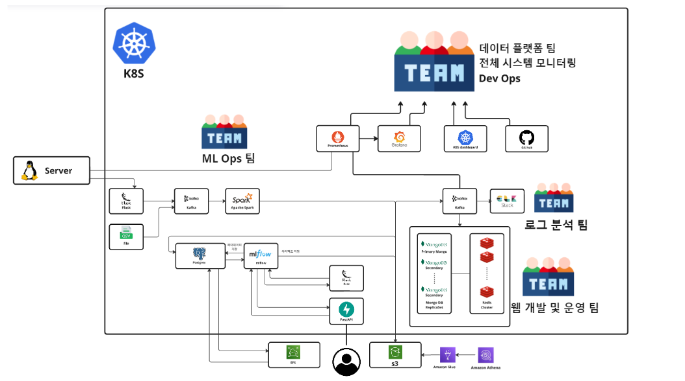

# Yeardream Miniproject - MLOps & DataPipeline System 

## License
이 프로젝트는 MIT License에 따라 배포됩니다.
다음을 참고 해주세요. [LICENSE](./LICENSE)

This project is licensed under the MIT License
see the [LICENSE](./LICENSE) file for details.

## Team Composition - GitHub IDs
- **Team Leader**: 서용원 - WestDragonWon
- **Team Members**:
  - 변준호 - Loafingcat
  - 김민규 - xxxmingyu
  - 이시형 - FirstBright
- **Contributors**:
  - 전영남 - 00nam11
  - 강재국 - kangjaeguk
 
# 발표 자료 영상

## 프로젝트 개요
이 프로젝트는 **MLOps**와 **데이터 파이프라인**을 통합한 견고한 시스템을 구축하는 것을 목표로 합니다. **AWS**와 **Kubernetes**를 기반으로 머신러닝 워크플로우 및 데이터 처리 파이프라인을 자동화하여, 머신러닝 모델의 확장과 대규모 데이터 처리를 위한 프로덕션 수준의 솔루션을 제공합니다. 

## 프로젝트 목표

1. Kubernetes 시스템의 이해

2. AWS 서비스의 이해

3. 단순히 도구를 이용해보는 실습이 아닌 도구들의 작동 방식과 사용 이유 각각의 주요 옵션들에 대한 이해를 기반으로 최대한 다양한 방식과 환경을 고려한 실습으로 이후 원하는 서비스를 제약없이 구축 할 수 있는 능력을 기르기

## 주요 기능

1. 대량의 데이터를 처리할 수 있는 안정적이고 확장 가능한 **데이터 파이프라인**

2. AWS 서비스와 Kubernetes를 활용한 높은 가용성(Availability)과 확장성(Scalability) 장애 허용성 제공.

- 멀티 AZ로 구성된 가용성과 더 나아가 다중 리전간의 가용성을 제공합니다.

3. Sha256 & k8s Secret & 각 도구들의 보안솔루션 등을 활용한 민감정보 보안(Security) 확보

4. 소스코드별 디렉토리정리 및 주석을 통한 가독성, 문서화를 고려하여 유지 보수성(Maintainability) 향상

5. 모니터링 도구에서 연동한 시스템 알람과 서비스 상태를 지속적으로 체크하기위한 Job을 스케쥴링하여 시스템 오류를 줄이고 복구능력을 높힌 신뢰성(Reliability) 제공

6. 다양한 기능과 가용성을 확보하면서도 비용(Cost) 최적화를 통하여 저렴하게 구축

7. 머신러닝 모델을 프로덕션에 배포하는 자동화된 **MLOps** 시스템

8. 워크플로우 전반에 걸쳐 보안과 데이터 영속성(Durability)과 정합성(Consistency)을 보장.

## 기술 스택
### Infrastructure
- **Cloud Provider**: AWS
- **Container Orchestration**: Kubernetes
- **Containerization**: Docker, DockerHub
- **OS**: Ubuntu
- **Code Version Control**: GitHub

### Data Pipeline
- **Workflow Management**: Apache Airflow, Crontab
- **Data Message Que**: Apache Kafka
- **Data Processing**: Apache Spark, Apache Flink, S3 Glue, ELK
- **Data DB & Storage**: Redis, MongoDB, AWS-EBS-gp3, AWS-EFS, AWS-S3, Amazon S3 Glacier

### Monitoring & Alerts
- **Monitoring**: K8s-Dashboard, Prometheus, Grafana
- **Alerting**: slack, discord, email

### MLOps
- **Model Registry & Tracking & Automated pipeline**: MLFlow 
- **Model Serving**: FastAPI, Flask
- **data storage**: Amazon S3(artifact), PostgreSQL(meta)
- **CI/CD**: GitHub Actions, Crontab

## 협업 도구

- **Code Version Control**: github
- **Online whiteboard platform**: miro
- **Workplace messaging platform**: slack
- **Real-time communication**: discord

## 프로젝트 진행 방식

### 적용된 개발 프로세스 방법론

## 프로젝트 스크럼
- **1차 스프린트**: 프로젝트 계획 & K8s 기반 구축 (8월 28일 - 9월 3일)
- **2차 스프린트**: MLOps 구축 (9월 3일 - 9월 12일)
- **3차 스프린트**: 데이터 파이프라인 구축 (9월 13일 - 9월 23일)
- **4차 스프린트**: 전체 시스템 고도화 (9월 25일 - 9월 30일)
- **5차 스프린트**: 전체 시스템 테스트 및 디버깅 (10월 1일 - 10월 4일)
- **6차 스프린트**: 포트폴리오 제작 및 배포 (10월 7일 - 10월 10일)

## 칸반 보드

- 각각의 작업이 어떤 상태인지(진행 중, 완료, 보류 등)를 파악하는 것이 쉽기 때문에, 개발 과정에서 일어나는 문제를 빠르게 파악하여 대처할 수 있습니다.

- 스프린트 주기에서 백로그의 모든 기능을 완료하고 그렇지 못한 경우는 다음 스프린트로 이월

## 피드백 루프

3. 5가지 빠른 피드백 루프를 적용했습니다.

빠른 피드백 루프: 피드백을 가능한 빨리 얻어 개선하는 것이 중요한데, 긴 주기의 릴리스 계획부터 짧은 주기의 단위 테스트, 코드 작성까지 다양한 단계에서 피드백이 이루어지는 과정을 나타냅니다.
계속적인 개선: 코드 작성부터 릴리스 계획까지의 각 단계에서 피드백을 받아 지속적으로 소프트웨어를 개선해 나갑니다.

- Pair Programming	두 명의 프로그래머가 함께 작업하여 코드를 작성하는 방법입니다. 한 명이 코드를 작성하고, 다른 한 명이 코드를 검토하고 지속적인 피드백을 제공하며 협업합니다.

해당 부분은 지속적으로 이루어지진 않았지만, 화면공유로 테스트환경에서 코드를 작성할때의 문제점이나 오타등을 팀원이 지적해주는 과정이 있었습니다.

- Unit Test + TDD	소프트웨어의 작은 부분인 유닛에 대한 테스트를 수행합니다. 유닛 테스트는 개별 함수 또는 모듈이 예상대로 작동하는지 확인하는 데 사용됩니다.

- Pair Negotiation	두 명의 사람이 함께 협상하여 문제를 해결하고, 결정을 내리는 과정입니다. 각각의 의견을 고려하며 협업하여 최선의 결론을 도출합니다.

- Stand-up Meeting	팀 구성원들이 매일 짧은 시간 동안 서로의 진행 상황과 장애물을 공유하는 미팅입니다. 팀의 커뮤니케이션과 협업을 도울 수 있는 기회가 제공됩니다.

- Acceptance Test	소프트웨어가 요구사항을 만족하는지 확인하는 테스트입니다. 사용자의 관점에서 시스템을 검증하며 사용자 승인을 받을 수 있는지 확인합니다.

## 목차
GitHub 각 디렉토리에서 관리되는 리소스나 도구는 이 프로젝트의 중요한 부분이며, 모든 폴더마다 `README.md` 파일을 통해 각각의 역할과 사용법을 확인할 수 있습니다.

### 디렉토리와 `README.md` 파일에 대한 링크를 제공합니다.
1. [.github/workflows](.github/workflows/README.md)
2. [aws](./aws/README.md)
    - [athena](./aws/athena/README.md)
    - [awscli](./aws/awscli/README.md)
    - [glue](./aws/glue/README.md)
3. [crontab](./crontab/README.md)
4. [docs](./docs/README.md)
5. [k8s](./k8s/README.md)
    >  [app](./k8s/app/README.md)
      - > [datacollection](./k8s/app/datacollection/python/README.md)
      - > [db](./k8s/app/db/README.md)
        - elasticsearch
        - [mongodb](./k8s/app/db/mongodb/README.md)
        - [postgresql](./k8s/app/db/postgresql/README.md)
        - [redis](./k8s/app/db/redis/README.md)
      - > [monitoring](./k8s/app/monitoring/README.md)
        - [exporter](./k8s/app/monitoring/exporter/README.md)
        - [grafana](./k8s/app/monitoring/grafana/README.md)
        - [prometheus](./k8s/app/monitoring/prometheus/README.md)
      - > [processing](./k8s/app/processing/README.md)
        - [kafka](./k8s/app/processing/kafka/README.md)
        - > [spark](./k8s/app/processing/spark/README.md)
          - [sparkjob](./k8s/app/processing/spark/sparkhome/README.md)
      - > [serving](./k8s/app/serving/README.md)
        - [FastAPI](./k8s/app/serving/README.md)
      - > [systeam](./k8s/app/system/README.md)
        - [aws-ebs-efs](./k8s/app/system/aws-ebs-efs/README.md)
        - [dashboard](./k8s/app/system/dashboard/README.md)
      - > [workflow](./k8s/app/workflow/README.md)
        - [airflow](./k8s/app/workflow/airflow/README.md)
          - [dags1](./k8s/app/workflow/airflow/dags/lsh/README.md)
          - [dage2](./k8s/app/workflow/airflow/dags/jun/README.md)
        - [mlflow](./k8s/app/workflow/mlflow/README.md)
   > [resources](./k8s/resources/README.md)
      - [configmap](./k8s/resources/configmap/README.md)
      - [pv](./k8s/resources/pv/README.md)
      - [role&serviceaccount](./k8s/resources/role&serviceaccount/README.md)
      - [secret](./k8s/resources/secret/README.md)
      - [service](./k8s/resources/service/README.md)
      - [storageclass](./k8s/resources/storageclass/README.md)
6. > [mlops](./mlops/iris/README.md)
7. > [mlops-test](./mlops-test/README.md)

---

## License
이 프로젝트는 MIT License에 따라 배포됩니다.
다음을 참고 해주세요. [LICENSE](./LICENSE)

This project is licensed under the MIT License
see the [LICENSE](./LICENSE) file for details.
