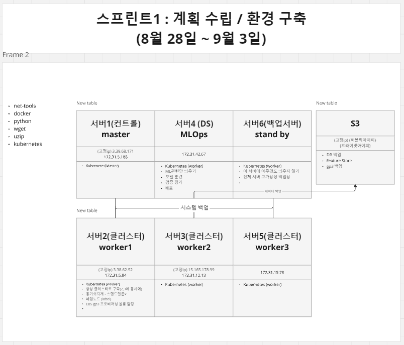
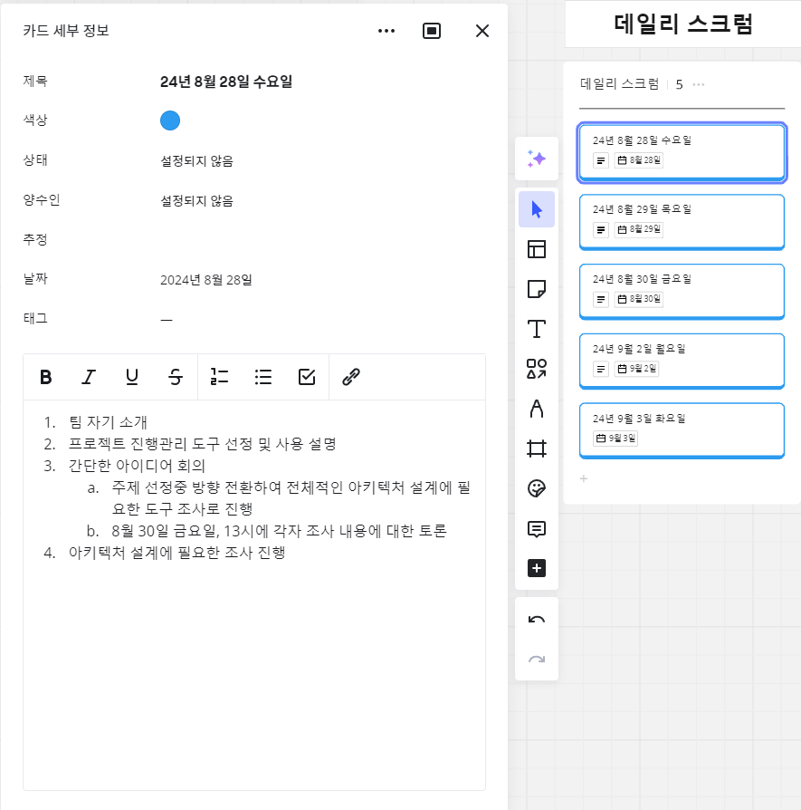
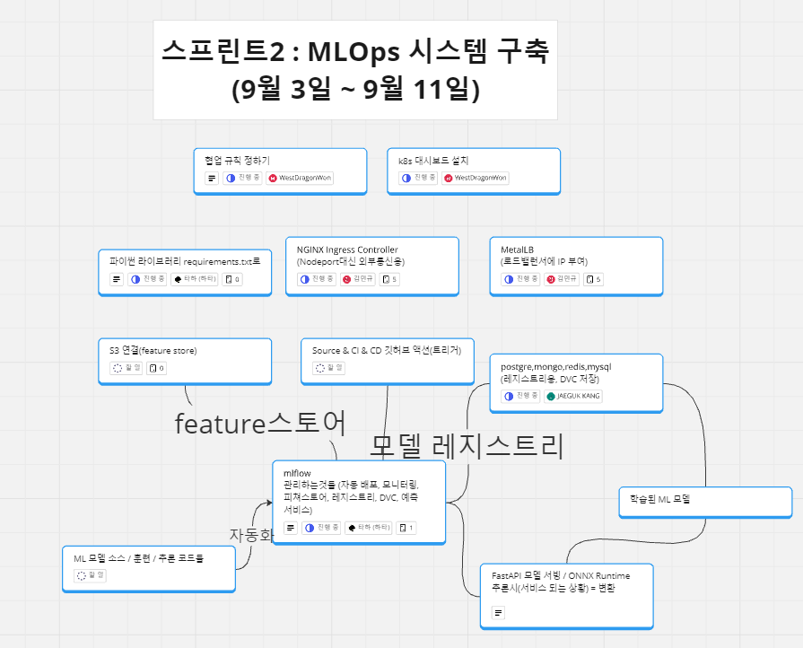
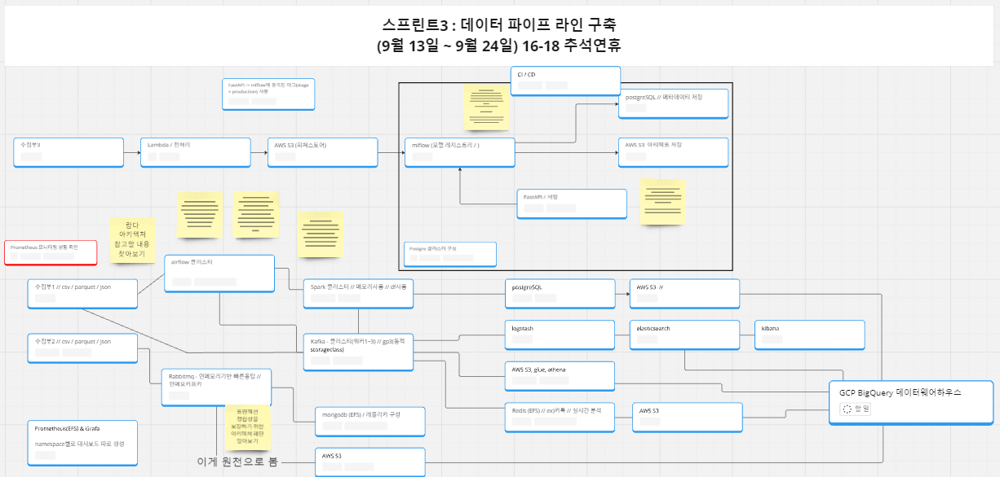

# Yeardream Miniproject - MLOps & DataPipeline System

## License
이 프로젝트는 MIT License에 따라 배포됩니다.
다음을 참고 해주세요. [LICENSE](./LICENSE)

This project is licensed under the MIT License
see the [LICENSE](./LICENSE) file for details.

## 프로젝트 개요
이 프로젝트는 **MLOps**와 **데이터 파이프라인**을 통합한 견고한 시스템을 구축하는 것을 목표로 합니다. **AWS**와 **Kubernetes**를 기반으로 머신러닝 워크플로우 및 데이터 처리 파이프라인을 자동화하여, 머신러닝 모델의 확장과 대규모 데이터 처리를 위한 프로덕션 수준의 솔루션을 제공합니다.

## Team Composition (GitHub IDs)
- **Team Leader**: 서용원 - WestDragonWon
- **Team Members**:
  - 변준호 - Loafingcat
  - 김민규 - xxxmingyu
  - 이시형 - FirstBright
- **Contributors**:
  - 전영남 - 00nam11
  - 강재국 - kangjaeguk

---

## 프로젝트 진행 방식

각 디렉토리에서 관리되는 리소스나 도구는 이 프로젝트의 중요한 부분이며, 해당하는 `README.md` 파일을 통해 각각의 역할과 사용법을 확인할 수 있습니다.

## 주요 기능
- **MLOps 자동화**: MLflow, FastAPI, S3를 사용하여 머신러닝 모델 개발, 배포 및 모니터링 프로세스를 자동화.
- **데이터 파이프라인**: Apache Airflow를 활용하여 데이터 워크플로우를 관리하고 ETL 파이프라인을 효율적으로 처리.
- **고가용성 (HA)**: Kubernetes 오케스트레이션 및 AWS 다중 리전 아키텍처를 사용하여 시스템의 안정성과 가용성 보장.
- **보안 및 확장성**: 여러 클라우드 환경에서 데이터의 안전한 처리와 서비스 확장을 목표.
- **CI/CD 통합**: 지속적인 통합 및 배포를 통해 개발 효율성을 높이고 프로덕션 배포 시간을 단축.
- **비용 효율성**: 한정된 예산 내에서 고가용성과 성능을 유지하면서 리소스를 최적화하여 비용 절감.

## 프로젝트 목표
1. 머신러닝 모델을 프로덕션에 배포하는 완전 자동화된 **MLOps** 시스템 구축.
2. 대량의 데이터를 처리할 수 있는 안정적이고 확장 가능한 **데이터 파이프라인** 구축.
3. 워크플로우 전반에 걸쳐 보안과 데이터 영속성을 보장.
4. Kubernetes와 클라우드 네이티브 도구를 적용하여 고가용성과 장애 허용성 달성.
5. CI/CD 관행을 도입하여 개발 프로세스를 최적화.
6. 단순히 도구를 구축하고 이용해보는 실습이 아닌 / 서비스를 배포하기 위한 도구들의 작동 방식과 각각의 주요 옵션들에 대한 정확한 이해를 기반으로 이후 원하는 서비스를 제약없이 구축 할 수 있는 능력을 기르기.

## 기술 스택
- **Cloud Provider**: AWS
- **Container Orchestration**: Kubernetes (K8s)

### Data Pipeline
- **Workflow Management**: Apache Airflow
- **Data Message Que**: Apache Kafka
- **Data Processing**: Apache Spark
- **Data DB & Storage**: Redis, MongoDB, AWS-EBS-gp3, AWS-EFS, AWS-S3
- **Data Engineering Automation**: Bash sh + Crontab, AWS CLI
- **Monitoring**: K8s-Dashboard, Prometheus, Grafana

### MLOps
- **MLOps**: MLFlow 
- **Model Serving**: FastAPI
- **data storage**: Amazon S3(artifact), PostgreSQL(meta)
- **CI/CD**: GitHub Actions

## 프로젝트 일정
- **1차 스프린트**: 계획 및 환경 설정 (8월 28일 - 9월 3일)

- **2차 스프린트**: MLOps 설정 (9월 3일 - 9월 12일)

- **3차 스프린트**: 데이터 파이프라인 개발 (9월 13일 - 9월 23일)

- **4차 스프린트**: 시스템 자동화 (9월 25일 - 9월 30일)
- **5차 스프린트**: 테스트 및 디버깅 (10월 1일 - 10월 4일)
- **6차 스프린트**: 포트폴리오 준비 (10월 7일 - 10월 10일)
- **최종 발표**: 10월 11일

---

## 목차
### 디렉토리와 `README.md` 파일에 대한 링크를 제공합니다.
1. [aws](./instance1/aws/README.md)
    - [athena](./instance1/aws/athena/README.md)
    - [awscli](./instance1/aws/awscli/README.md)
    - [glue](./instance1/aws/glue/README.md)
2. [crontab](./instance1/crontab/README.md)
3. [docs](./instance1/docs/README.md)
4. [k8s](./instance1/k8s/app/README.md)
   - [app](./instance1/k8s/app/README.md)
     - [db]
       - [elasticsearch]
       - [mongodb](./instance1/k8s/app/db/mongodb/README.md)
       - [postgresql](./instance1/k8s/app/db/postgresql/README.md)
       - [redis](./instance1/k8s/app/db/redis/README.md)
     - [monitoring]
       - [alertmanager](./instance1/k8s/app/monitoring/README.md)
     - [processing](./instance1/k8s/app/processing/README.md)
       - [kafka](./instance1/k8s/app/processing/kafka/README.md)
       - [spark](./instance1/k8s/app/processing/spark/README.md)
     - [serving](./instance1/k8s/app/serving/README.md)
     - [system]
       - [aws-ebs-efs](./instance1/k8s/app/system/README.md)
       - [dashboard](./instance1/k8s/app/system/dashboard/helm/README.md)
       - [helm]
       - [metallb](./instance1/k8s/app/systeam/metallb/README.md)
       - [namespace](#system)
       - [nginx-ingress-controller](#system)
     - [workflow](./instance1/k8s/app/workflow/README.md)
       - [airflow](./instance1/k8s/app/workflow/airflow/README.md)
       - [mlflow](./instance1/k8s/app/workflow/mlflow/README.md)
   - [resources](#resources)
     - [configmap](#resources)
     - [namespace]
     - [pv](#resources)
     - [role]
     - [secret](#resources)
     - [serviceaccount]
     - [storageclass](./instance1/k8s/resources/storageclass/README.md)
     - [job/cronjob]

---

## License
이 프로젝트는 MIT License에 따라 배포됩니다.
다음을 참고 해주세요. [LICENSE](./LICENSE)

This project is licensed under the MIT License
see the [LICENSE](./LICENSE) file for details.