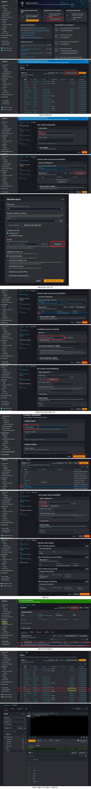

# AWS GLUE

## 목차

1. [개요](#개요) 
2. [사용 이유](#사용-이유) 
3. [이용 방법](#이용-방법)

## 개요

AWS Glue는 데이터 준비 및 관리 작업을 자동화하는 서버리스 데이터 통합 서비스입니다. Glue는 70개 이상의 다양한 데이터 소스를 연결할 수 있으며, 데이터 카탈로그를 관리하고, ETL(Extract, Transform, Load) 파이프라인을 시각적으로 생성, 실행 및 모니터링할 수 있습니다. 이를 통해 데이터 파이프라인을 쉽게 구축하여 데이터 레이크로 데이터를 로드하고 통합할 수 있습니다.

## 사용 이유

1. 서버리스 ETL: AWS Glue는 서버리스 방식으로 운영되어 인프라 관리가 필요하지 않으며, ETL 파이프라인을 빠르게 구축할 수 있습니다.
2. 중앙 집중식 데이터 카탈로그: 데이터 자산을 한 곳에서 관리할 수 있으며, 다양한 데이터 소스 간 연결을 통해 통합된 데이터 뷰를 제공합니다.
3. 자동화된 데이터 변환: Glue는 ETL 작업을 자동으로 생성 및 실행하며, 개발자들이 직접 코드 작성 없이 데이터 변환 및 로드를 자동화할 수 있습니다.

## 이용 방법

1. Glue 데이터 카탈로그에 S3, RDS, Redshift 등 다양한 데이터 소스를 등록합니다.
2. Glue 콘솔에서 ETL 작업을 시각적으로 구성하여 데이터 변환 및 로드를 설정합니다.
3. 생성된 ETL 작업을 실행하고, 작업 진행 상황 및 결과를 콘솔에서 모니터링합니다.

