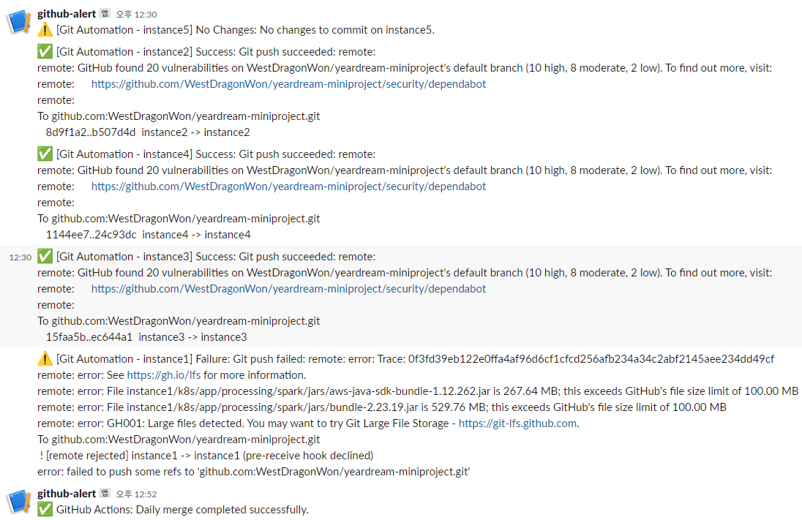

# Crontab Scheduling

## 목차
1. [Git Repository 자동화 및 알람](#git-repository-자동화-및-알람)
   - [gitpush.sh 개요](#gitpushsh-개요)
   - [주요 기능](#주요-기능)
   - [스크립트 작동 방식](#스크립트-작동-방식)
   - [설정 방법](#설정-방법)
   - [`.env` 파일 설정](#env-파일-설정)

3. [Airflow DAGs 백업](#airflow-dags-백업)
   - [백업 스크립트 개요](#백업-스크립트-개요)
   - [작동 방식](#작동-방식)
   - [종속성 및 Docker 이미지](#종속성-및-docker-이미지)

3. [Python 라이브러리 자동 백업](#python-라이브러리-자동-백업)
   - [자동 백업 개요](#자동-백업-개요)
   - [파이썬 파일 코드](#파이썬-파일-코드)
   - [crontab을 이용한 업데이트 자동화](#crontab을-이용한-업데이트-자동화)

4. [Spark Job](#Spark-job)

## Git Repository 자동화 및 알람
### gitpush.sh 개요
이 스크립트는 **Git 자동화**와 **Slack 알림**을 지원하는 Bash 스크립트입니다. Git 변경사항을 자동으로 커밋하고 푸시하며, 작업 결과에 따라 Slack으로 성공 또는 실패 메시지를 전송합니다. 이 스크립트는 **Crontab**과 같은 작업 스케줄러에서 주기적으로 실행할 수 있도록 설계되었습니다.

### 주요 기능

1. **환경 변수 로드**:
   스크립트는 지정된 `.env` 파일을 로드하여 Slack 웹훅 URL과 같은 중요한 환경 변수를 설정합니다. `.env` 파일이 없을 경우 오류 메시지를 출력하고 스크립트를 중지합니다.

2. **Slack 메시지 전송**:
   Git 작업의 성공 또는 실패 여부를 Slack 웹훅을 통해 알림으로 전송합니다. 메시지에는 성공 시 ✅ 이모지가, 실패 시 ⚠️ 이모지가 포함됩니다.

- instance1에선 용량이 100MB 초과되는 파일은 push되지 않기때문에 오류 메세지가 왔네요! 해당파일을 ignore추가하여 해결하였습니다.
- instance5에서도 push되지 않았기에 ⚠️이모지로 메세지가 왔지만 변경된 commit이 없는 경우라 해당 경우도 ✅가 뜨도록 옵션을 추가하면 됩니다.

3. **SSH 설정**:
   - **SSH 에이전트 실행**: SSH 키를 로드하여 GitHub에 푸시할 수 있도록 SSH 에이전트를 실행합니다.
   - **GitHub 호스트 키 추가**: GitHub의 호스트 키를 `~/.ssh/known_hosts`에 추가하여 신뢰할 수 있는 연결을 보장합니다.

4. **Git 자동화**:
   - **변경사항 커밋**: 프로젝트 디렉토리 내 변경사항을 자동으로 커밋합니다. 변경사항이 없으면 "No Changes" 메시지를 Slack에 전송하고 종료합니다.
   - **푸시**: 변경사항을 원격 저장소의 지정된 브랜치(`instance1`)로 푸시합니다. 푸시 결과에 따라 Slack에 성공 또는 실패 메시지를 전송합니다.

### 스크립트 작동 방식

1. **환경 변수 설정**:
   스크립트는 먼저 경로와 `.env` 파일을 설정하고, 해당 파일에서 필요한 환경 변수를 로드합니다.

2. **SSH 설정 및 GitHub 호스트 키 추가**:
   SSH 에이전트를 실행하고 GitHub에 접근할 수 있도록 SSH 키를 추가한 후, GitHub의 호스트 키가 `~/.ssh/known_hosts` 파일에 없는 경우 자동으로 추가합니다.

3. **Git 설정**:
   Git 설정을 통해 사용자 이름과 이메일을 지정합니다. 이는 자동 커밋 시 사용할 정보입니다.

4. **Git 커밋 및 푸시**:
   - 변경사항이 있을 경우, 자동으로 커밋 메시지를 작성하여 커밋을 수행합니다.
   - 원격 저장소의 지정된 브랜치로 변경사항을 푸시하고, 푸시 성공 또는 실패에 대한 메시지를 Slack으로 전송합니다.

5. **Crontab을 사용한 자동화 작업**:
   이 스크립트는 `Crontab`을 사용하여 주기적으로 실행할 수 있습니다. 아래의 예시는 매일 12:30과 17:30에 `gitpush.sh` 스크립트를 실행하고, 로그 파일을 원하는 date 이름구조로 특정 경로에 저장하는 방식입니다.

   ```bash
   30 12 * * * /home/ubuntu/yeardream-miniproject/instance1/crontab/gitpush.sh >> /home/ubuntu/yeardream-miniproject/instance1/crontab/logs/gitpush/logfile_$(date +\%Y\%m\%d_\%H\%M\%S).log 2>&1
   30 17 * * * /home/ubuntu/yeardream-miniproject/instance1/crontab/gitpush.sh >> /home/ubuntu/yeardream-miniproject/instance1/crontab/logs/gitpush/logfile_$(date +\%Y\%m\%d_\%H\%M\%S).log 2>&1

### 설정 방법

### 1. `.env` 파일
`.env` 파일은 다음 경로에 위치해야 합니다:  
`/home/ubuntu/yeardream-miniproject/instance1/crontab/.env`

`.env` 파일에는 아래와 같은 환경 변수가 포함되어 있어야 합니다:

```bash
SLACK_WEBHOOK_URL=your-slack-webhook-url
```

## Airflow DAGs 백업

### 백업 스크립트 개요
이 스크립트는 Kubernetes 클러스터 내의 **Airflow** pod를 특정하여 파드에서 로컬로 dags 파일들을 복사하는 역할을 합니다. 스크립트의 주된 목적은 외부에 mount되어 관리되는 Dags 파일들을 수동으로 Github에 푸쉬하기가 너무 귀찮기때문에 자동 푸쉬기능이 있는 instance로 주기적으로 옮기는 역할입니다. 이미 보장되어 있는 데이터의 지속성이나 무결성과는 전혀 상관없..(단순 소스코드 업로드용)

### 작동 방식
1. **로컬 및 파드 경로 설정**:
   - **로컬 경로**: DAGs 파일이 백업될 로컬 경로를 설정합니다.
   - **파드 경로**: Kubernetes 클러스터 내에서 Airflow Webserver 파드의 DAGs 파일 경로를 설정합니다.

2. **파드 이름 확인**:
   스크립트는 `kubectl` 명령어를 사용하여 `app=airflow-webserver` 레이블을 가진 파드의 이름을 자동으로 가져옵니다.

3. **파일 복사**:
   `kubectl cp` 명령어를 사용하여 파드 내의 DAGs 폴더를 로컬로 복사하여 백업을 수행합니다.

### 종속성 및 Docker 이미지
Airflow 백업 스크립트를 실행하려면 몇 가지 종속성과 커스텀 Docker 이미지가 필요합니다. 아래는 설정 방법입니다.

필요한 종속성:

- rsync: 파일 복사 및 백업을 위한 도구
- Dockerfile 설정: 아래는 Airflow를 위한 Dockerfile 설정 예시입니다. rsync를 설치하고 root 사용자로 전환한 후, 필요한 설정을 완료합니다.

```Dockerfile
FROM apache/airflow:2.9.3-python3.8

# root 사용자로 전환
USER root

# rsync와 confluent_kafka 설치
RUN apt-get update && \
    apt-get install -y rsync && \
    pip install confluent-kafka  # Kafka 클라이언트 설치

# Airflow 실행에 필요한 사용자로 다시 전환
USER airflow

# Airflow 웹서버 시작 명령어
CMD ["airflow", "webserver"]
```


## Python 라이브러리 자동 백업

### 자동 백업 개요

인스턴스 내에 환경설정에 필요한 라이브러리 목록을 자동으로 갱신하기 위해 만들어진 파이썬 파일입니다. crontab을 통해 하루에 한번 지정한 시간에 인스턴스 내부 라이브러리 목록을 requirements.txt 파일에 저장하게 됩니다.

### 파이썬 파일 코드

		from importlib.metadata import distributions
		import sys

		# 현재 파이썬이 설치된 경로
		sys.path.append('/home/ubuntu/.pyenv/shims/python3')

		# 현재 설치된 패키지 메타데이터를 반환 패키지 이름을 키로, 버전을 값으로 가지게 됨
		installed_packages = {dist.metadata['Name']: dist.version for dist in distributions()}

		# requirements.txt 파일 경로를 설정
		requirements_file = '/home/ubuntu/yeardream-miniproject/instance1/crontab/requirements.txt'

		# w 쓰기 모드로 설치된 버전을 설정한 형식으로 저장
		try:
			
			with open(requirements_file, 'w') as f:
				for package, version in installed_packages.items():
					f.write(f"{package}=={version}\n")
			print(f"{requirements_file}가 성공적으로 업데이트되었습니다.")
		except Exception as e:
			print(f"오류 발생: {e}")


importlib.metadata: 이 모듈은 Python 패키지의 메타데이터에 접근할 수 있게 해줍니다.

### crontab을 이용한 업데이트 자동화

	30 17 * * * /home/ubuntu/.pyenv/shims/python3 /home/ubuntu/yeardream-miniproject/instance1/crontab/update_requirements.py >> /home/ubuntu/yeardream-miniproject/instance1/crontab/logs/requirements/req_log_$(date +%Y-%m-%d).log 2>&1

하루에 한 번만 오후 5시 30분에 실행되고 파이썬 파일로 작성했기 때문에 실행하기 위해 파이썬 인터프리터 경로를 지정해줍니다. 

지정한 경로에 그날 날짜를 이름으로 한 log 파일이 생성되는 설정을 추가했습니다.

## Spark job

### 개요
deploy mode가 Kubernetes인 Spark job은 예상치 못한 상황으로 중단된 경우 deployment 등으로 관리되는 pod처럼 자동으로 재시작되지 않기 때문에 종료를 감지하고, 다시 시작해야합니다.

스파크 잡에 라벨을 붙여 파드가 Running상태로 동작중인지를 파악하고, 아니라면 다시 작동시키는 역할을 하는 코드를 5분 간격으로 실행합니다.

[Spark job 1](iris-spark.sh)  
[Spark job 2](consumer-s3-watcher.sh)

[Spark 설명](../k8s/app/processing/spark/README.md)  
[Spark job 설명](../k8s/app/processing/spark/sparkhome/README.md)

1. `kubectl get pod -l app=iris-s3 -o jsonpath='{.items[0].status.phase}' 2>/dev/null ` 명령으로 특정 라벨의 파드 상태를 확인합니다.  
2. Running 상태가 아니라면 기존의 파드를 삭제하고, 스파크 잡을 다시 제출합니다.