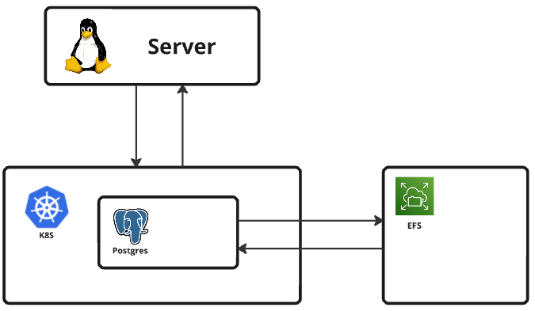

## 목차

1. [개요](#개요)
2. [필요 환경](#필요-환경)
3. [구성 요소](#구성-요소)
4. [설치](#설치)
5. [사용 방법](#사용-방법)
6. [구현](#관련된-파일,-간단한-설명)


## 개요

Kubernetes 환경에서 PostgreSQL 클러스터를 배포하기 위한 구성을 제공합니다.

내구성, 가용성에 초점을 두었으며, 이를 위해 데이터를 AWS의 여러 가용영역에 저장하고, 다수의 인스턴스에서 접속할 수 있게 할 수 있도록 EFS를 마운트하여 데이터를 저장하였습니다.



EBS를 볼륨으로 사용하고자 하는 경우 시스템 다운을 막기 위해 반드시 수평적 확장 기능을 포함시켜야 합니다. (현재는 용량 제한이 없는 EFS를 사용중)

## 필요 환경

- Kubernetes 클러스터
- EFS 파일 시스템 (파일 생성 권한이 있어야 함)
- 클러스터에 설치된 EFS CSI 드라이버


## 구성 요소

- 주 PostgreSQL 인스턴스를 위한 ConfigMap, StatefulSet, Service
- 영구 데이터 저장을 위한 EFS
- EFS를 사용하기위한 PersistentVolume, PersistentVolumeClaim


## 설치

1. 저장소를 클론합니다. 파일은 instance1/k8s/app/db/postgresql에 위치합니다.
    ```
    git clone https://github.com/WestDragonWon/yeardream-miniproject.git
    ```

2. PV에 본인의 EFS ID를 작성합니다. (volumeHandle부분)
    ```
    vim instance1/k8s/resources/pv/postgres-pv.yaml
    ```

3. 구성을 적용합니다.
    ```
    kubectl apply -f <clone한 경로>/instance1/k8s/resources/storageclass/postgresql-storageclass.yml
    kubectl apply -f <clone한 경로>/instance1/k8s/resources/configmap/postgres-cm.yml
    kubectl apply -f <clone한 경로>/instance1/k8s/resources/pv/postgres-pv.yaml
    kubectl apply -f <clone한 경로>/instance1/k8s/app/db/postgresql/postgresql.yaml
    ```


## 사용 방법

PostgreSQL Pod 연결 :
  
    `kubectl exec -it postgres-0 -- /bin/bash -c "psql -U postgres"`
  

postgres 유저로 Postgres 실행 (Pod 내에서): 
    `psql -U postgres`  
데이터베이스 리스트 : `\list`  
데이터베이스 접속 : `-c 데이터베이스 이름`

## 관련된 파일, 간단한 설명

**deployment, service**
파일 명 : postgresql.yaml
위치 : instance1/k8s/app/db/postgresql/
목적 : Postgres용 StatefulSet, Service를 만든다

**storageclass**
파일 명 : postgresql-storageclass.yml
위치 : instance1/k8s/resources/storageclass/
목적 : pv로 EFS를 사용할 수 있도록 한다.

**persistentvolume, persistentvolumeclaim**
파일 명 : postgres_pv.yaml
위치 : instance1/k8s/resources/pv/
목적 : postgres의 데이터 저장소를 EFS와 연동하여 사용하기위한 볼륨을 만든다

**configmap**
파일 명 : postgresql-cm.yml
위치 : instance1/k8s/resources/configmap/
목적 : 모든 IP에서 PG에 접근할 수 있도록 설정파일에서 접근권한을 수정한다.

코드에 대한 설명은 주석으로 작성해놓았습니다.