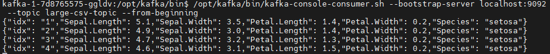
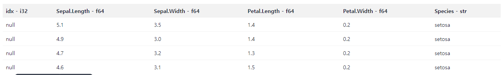

## sparkKafka2s3.py
- 

### 문제해결
- kafka와 spark의 namespace가 다름
- spark.hadoop이 s3관련 처리를 하는데 이 하둡에도 s3설정들이 필요함
- kafka 관련 jar 파일
- s3:// 형식이 아니라 s3a://형식임

- index값을 코드에 정의한 스키마 타입 integer가 아닌 string으로 넣음

- index값을 parquet파일에서 확인 할 수 없음