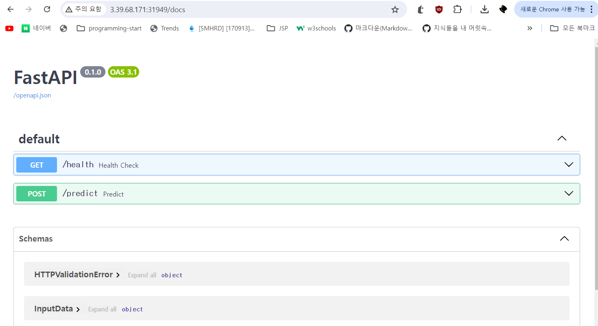

# fastAPI in Kube

# 목차

1. [개요](#개요)
2. [실행환경](#실행환경)
3. [Why fastAPI?](#why-fastapi)
4. [설치방법](#설치방법)
5. [실행방법](#실행방법)

----------------------------

## 개요

쿠버네티스 환경에서 fastAPI 사용법 및 고려해야할 사항에 대해 기술함.

## Why fastAPI?

API를 쉽게 구축하게 해주고 비동기 프로그래밍을 지원하기 때문에  I/O 작업이나 네트워크 요청같이 시간이 오래 걸리는 작업 처리에 유용하기 때문에 사용한다.

## 실행환경

OS: Ubuntu 24.04.1 LTS
Python: 3.11.9
fastapi: 0.114.0
pydantic: 2.9.1
mlflow: 2.16.0
numpy: 2.1.1
uvicorn: 0.30.6

## 설치방법

- **유의점**

컨테이너 기반 자동화 및 항상 일정한 실험환경을 위해 버전을 고정시킬 필요가 있다.

1. 구동시킬 app.py 작성(dockerfile과 같은 경로에 앱이 존재해야함)

    **app.py**

        from fastapi import FastAPI, HTTPException
        from pydantic import BaseModel
        import mlflow
        import mlflow.pyfunc
        import numpy as np

        app = FastAPI()

        # MLflow tracking URI 및 실험 설정
        mlflow.set_tracking_uri("http://10.103.73.87:8080")  # service cluster ip
        mlflow.set_experiment("testjun")  # 실험 이름으로 변경

        class InputData(BaseModel):
            model_name: str  # 모델 이름 추가
            version: int     # 모델 버전 추가
            features: list

        @app.post("/predict")
        def predict(data: InputData):
            try:
                # 모델 URI 설정 (모델 이름과 버전)
                model_uri = f"models:/{data.model_name}/{data.version}"  # 동적으로 모델 URI 생성
                model = mlflow.pyfunc.load_model(model_uri)  # 모델 로드
                
                # 입력 데이터 형태 변경
                features = np.array(data.features).reshape(1, -1)
                
                # 예측 수행
                prediction = model.predict(features)
                
                # 결과 반환
                return {
                    "prediction": int(prediction[0])
                }
            except ValueError:
                raise HTTPException(status_code=400, detail="잘못된 입력 데이터입니다. 입력을 확인하세요.")
            except Exception as e:
                raise HTTPException(status_code=500, detail=str(e))

2. 라이브러리 버전 지정을 위한 requirements.txt 작성

    **requirements.txt**

        fastapi: 0.114.0
        pydantic: 2.9.1
        mlflow: 2.16.0
        numpy: 2.1.1
        uvicorn: 0.30.6

    필요한 라이브러리의 버전을 지정하고 이미지화 시킴으로써 일정한 실행 환경이 유지된다.

3. Dockerfile을 작성

    **Dockerfile**

        # 베이스 이미지
        FROM python:3.11.9-slim

        # 작업 디렉토리 설정
        WORKDIR /app

        # 의존성 파일 복사
        COPY requirements.txt .

        # 의존성 설치
        RUN pip install --no-cache-dir -r requirements.txt

        # 애플리케이션 소스 복사
        COPY . .

        # FastAPI 실행
        CMD ["uvicorn", "app:app", "--host", "0.0.0.0", "--port", "8000"] 

4. 이미지 빌드 및 docker hub로 push 하기

- docker build -t [이미지 이름] .

- docker login

- docker tag [repository name] username/repository:(원하는 버전이나 latest)

- docker push username/repository:지정한 버전

5. 쿠버네티스에 설치하기 위한 deployment 작성

    apiVersion: apps/v1
    kind: Deployment
    metadata:
    name: fastapi
    spec:
    replicas: 1
    selector:
        matchLabels:
        app: fastapi
    template:
        metadata:
        labels:
            app: fastapi
        spec:
        containers:
        - name: fastapi-container
            image: loafingcat/fastapi-app:1.0
            ports:
            - containerPort: 8000
            resources:
            requests:
                memory: "256Mi" 
                cpu: "250m"    
            limits:
                memory: "512Mi"
                cpu: "500m"
            livenessProbe:
            httpGet:
                path: /health
                port: 8000
            initialDelaySeconds: 30
            periodSeconds: 5
            readinessProbe:
            httpGet:
                path: /health
                port: 8000
            initialDelaySeconds: 30
            periodSeconds: 5

    ---
    apiVersion: v1
    kind: Service
    metadata:
    name: fastapi-service
    spec:
    type: NodePort
    ports:
    - port: 8000        # 외부에서 접근할 포트
        targetPort: 8000  # 컨테이너 내의 포트
        nodePort: 31949   # 노드에서 사용할 포트 (명시적으로 설정)
    selector:
        app: fastapi

만든 이미지를 사용하고 앱의 이름, 헬스 체크, 외부 접근을 위한 nodeport 설정 등이 있다.

- kubectl apply -f filename.yaml

위 명령어를 통해 pod 등록 이후 서비스에 설정했던 포트를 통해 web ui에 접근한다.

## 실행방법

- http://<aws_public _ip>:31949/docs

이렇게 접근이 가능하게 된다.

