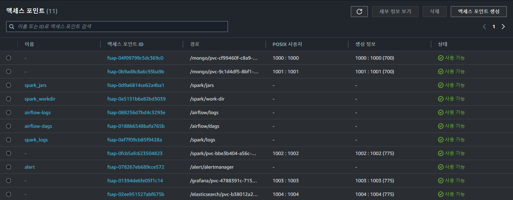
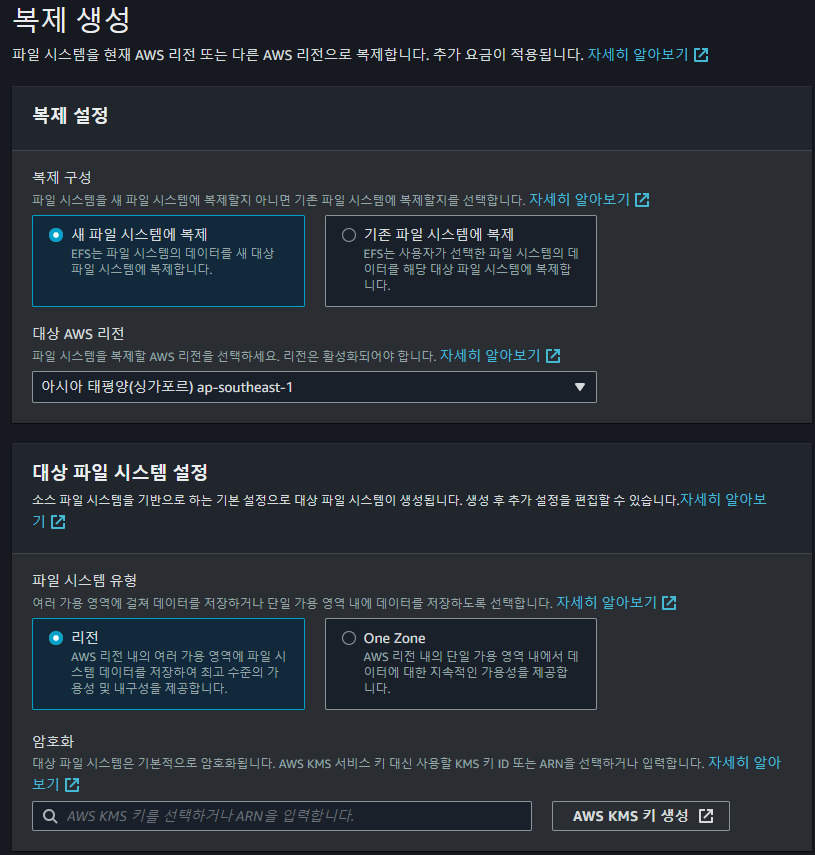

# Kubernetes StorageClass 사용 가이드

## 개요
이 문서는 AWS EFS 및 EBS를 기반으로 한 Kubernetes `StorageClass`를 정의하고 사용하는 방법을 설명합니다. Kubernetes 클러스터에서 `StorageClass`를 사용하여 영구적인 스토리지를 자동으로 프로비저닝할 수 있습니다. 
 - `storageclass`란 동적 스토리지 프로비저닝을 지원하기 위해 사용되는 리소스 입니다.
 - 스토리지를 수동으로 생성하고 관리하는 데 필요한 작업을 줄이고, 애플리케이션 배포의 속도와 효율성을 높입니다.

## 1. StorageClass란?
`StorageClass`는 Kubernetes에서 스토리지 프로비저닝 방식을 정의하는 리소스입니다. 클러스터 내에서 PVC(PersistentVolumeClaim)가 생성될 때, 이를 기반으로 필요한 스토리지(볼륨)를 자동으로 할당받을 수 있습니다. 

## 2. EFS 기반 StorageClass 설정
### 주요 구성 요소:
- **provisioner**: EFS CSI 드라이버(`efs.csi.aws.com`)를 사용하여 AWS의 EFS(Elastic File System)에 연결합니다.
- **provisioningMode**: `efs-ap` 모드를 사용하여 EFS Access Point로 스토리지를 프로비저닝합니다.
- **fileSystemId**: AWS 콘솔에서 제공하는 EFS 파일 시스템의 고유 ID를 입력하여, 해당 파일 시스템과 연결합니다.
- **directoryPerms**: 디렉터리 권한 설정으로 `775` 권한을 부여하여 그룹이 읽고 쓰기가 가능하도록 설정합니다.
- **gidRangeStart / gidRangeEnd**: 특정 그룹 ID 범위를 지정하여 스토리지를 사용할 수 있는 그룹의 범위를 정의합니다.
- **basePath**: EFS에 연결될 경로를 지정합니다. 이 경로 하위에 디렉터리가 생성되어 마운트됩니다.

### EFS 설정 시 유의사항:
- EFS는 공유 파일 시스템으로 여러 Pod가 동시에 읽고 쓰기를 할 수 있으므로, 권한 설정 및 마운트 경로를 주의 깊게 설정해야 합니다.
- AWS EFS CSI 드라이버를 통해 Kubernetes에서 EFS를 사용할 수 있습니다.



### 복제 설정




## 3. EBS 기반 StorageClass 설정
### 주요 구성 요소:
- **provisioner**: EBS CSI 드라이버(`ebs.csi.aws.com`)를 사용하여 AWS의 EBS(Elastic Block Store)를 프로비저닝합니다.
- **volumeBindingMode**: `WaitForFirstConsumer` 옵션을 사용하여, PVC가 실제로 요청되기 전까지 볼륨 프로비저닝을 지연시킵니다.
- **reclaimPolicy**: `Retain` 정책을 설정하여 PVC가 삭제되더라도 EBS 볼륨을 유지합니다.
- **parameters**:
  - **type**: `gp3` 유형의 EBS 볼륨을 생성합니다.
  - **fsType**: `ext4` 파일 시스템을 사용하여 볼륨을 포맷합니다.

### EBS 설정 시 유의사항:
- EBS 볼륨은 각 Pod에 고유하게 할당되며, 공유 파일 시스템으로 사용하지 못합니다.
- EBS는 특정 가용 영역(Availability Zone)에 연결되므로, 배포 시 Pod와 EBS 볼륨의 가용 영역을 일치시켜야 합니다.

## 4. StorageClass 사용 방법
1. **StorageClass 생성**: 위의 YAML 파일을 참조하여 Kubernetes 클러스터에 StorageClass를 생성합니다.
   ```bash
   kubectl apply -f <storageclass-yaml>


StorageClass 리소스의 주요 내용

fsType: ext4
생성된 스토리지 볼륨에 사용할 파일 시스템 유형입니다. 여기서는 ext4 파일 시스템을 사용하도록 지정합니다.
type: gp3
AWS EBS의 경우 ext4가 기본값

reclaimPolicy:
기본값: Delete
설명: PersistentVolume(PV)이 삭제될 때의 동작을 정의합니다. Delete는 PVC가 삭제될 때 PV도 삭제하는 정책이고, Retain은 PVC가 삭제되더라도 PV를 보존하는 정책

provisioner: ebs.csi.aws.com
Kubernetes 클러스터에서 실제로 스토리지를 프로비저닝하는 CSI(Container Storage Interface) 드라이버fh
AWS EBS 볼륨을 동적으로 스토리지를 프로비저닝하는 데 사용할 CSI(Container Storage Interface) 입니다. 

volumeBindingMode: WaitForFirstConsumer
기본값: Immediate
스토리지 볼륨을 생성할 시기를 제어합니다. Immediate는 PVC가 생성되면 즉시 볼륨을 생성합니다. WaitForFirstConsumer는 PVC가 특정 노드에 바인딩될 때까지 (첫 번째 소비자가 있을 때까지) 볼륨 생성을 지연시킵니다. 즉, PersistentVolumeClaim이 특정 노드에 바인딩될 때까지 볼륨이 생성되지 않습니다. 이는 리소스를 최적화하고 스케줄링을 개선하는 데 유용합니다.

중요한 부분은 volumeBindingMode: WaitForFirstConsumer 설정입니다. 이 설정이 PVC가 생성될 때 EBS 볼륨이 어느 가용영역에서 생성될지 결정하는 핵심입니다. 이 모드는 PVC가 Pod와 바인딩되는 시점에 해당 Pod가 실행되는 노드의 가용영역에 맞게 EBS 볼륨을 생성하도록 보장합니다.

WaitForFirstConsumer 모드를 사용하면 Kubernetes는 PVC가 실제로 사용되는 노드에 맞춰 EBS 볼륨을 동적으로 프로비저닝합니다.

volumeBindingMode: Immediate
스토리지 프로비저닝의 바인딩 방식을 지정합니다.

Immediate: PersistentVolumeClaim(PVC)이 생성되면 즉시 PersistentVolume(PV)이 할당됩니다. 즉, 사용자가 PVC를 요청할 때, 스토리지가 즉시 프로비저닝됩니다.
이 설정은 볼륨이 특정 노드에 바인딩되지 않고, 클러스터 내의 어느 노드에서도 사용될 수 있는 EFS와 같은 공유 스토리지에 적합합니다.

# ReadWriteOnce로 되어있는거 바꿔주기

- ReadWriteMany  # EFS에 맞는 접근 모드

# EFS에서 생성한 새로운 starageClassName을 넣어주기

storageClassName: # EFS 스토리지 클래스 이름


## gp3는 하나로쓰고 efs는 나누는 이유
gp3는 프로비저닝시 pod다 개별적으로 볼륨이 생성되므로 상관없음
efs는 모두가 공유하는 스토리지이기 때문에 마운트 경로를 다르게 해야함
-> basePath: "/airflow" # EFS에 마운트할 디렉터리 경로