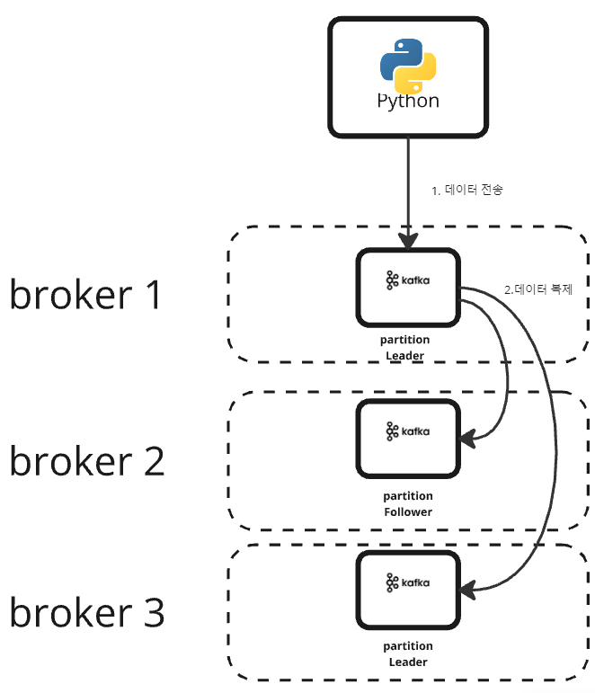
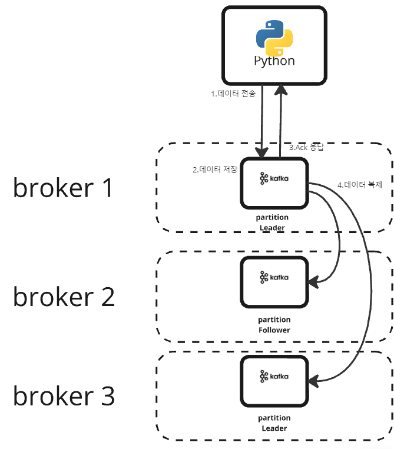
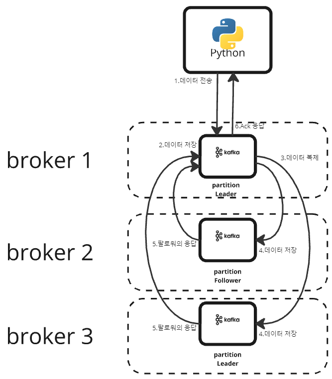

# Front page

## 개요

고객의 주문을 입력받을 수 있는 Flask page를 구현하였습니다. 
.png>)  
이름, ID 등의 데이터을 입력받아 Kafka의 user-data 토픽으로 전달하는 프로듀서의 역할을 합니다.  
저희 시스템에서는 카프카의 토픽이 자동으로 생성되지 않게 해놓았기때문에 데이터를 입력받기 전 반드시 카프카의 토픽을 생성해야 합니다.  
예)   `./kafka-topics.sh --create --topic user-topic --bootstrap-server localhost:9092 --partitions 3 --replication-factor 3`  
추가로, 카프카와 같은 네임스페이스에서 동작하는 걸 전제로 작성하였습니다. 만약 다른 네임스페이스에서 작동시키시려면 추가적인 작업이 필요합니다.

## 실행 방법
flask-page 디렉토리에 위치한 Dockerfile을 사용해 빌드, 푸시 후 flaskpage.yaml에 이미지 부분을 본인이 푸시한 이미지로 수정하여 kubectl에 apply합니다. 

## 동작 방식

주문 버튼 클릭시 데이터가 카프카 브로커로 전달됩니다.
.png>)  

## 아쉬운 점
데이터를 카프카에 넣기 전 데이터를 분석하여 이상 거래인지 아닌지 탐지하는 부분을 구현하려고 했으나 우선순위에 밀려 구현하지 못했습니다.  

## 테스트
### 카프카 토픽 삭제

.png>)
카프카 토픽을 삭제 후 재생성하면 어떻게 동작하는지 확인해보았습니다.
.png>)
토픽 파티션의 오프셋이 10에서 1로 돌아갔다는 메시지로 오류가 발생했습니다.  
  
원인 : 카프카의 오프셋을 저장하기 위해 S3에 체크포인트를 설정하였습니다. 체크포인트의 오프셋과, 토픽 삭제 후 재생성시 만들어진 오프셋 간에 차이가 발생하였습니다.  
카프카의 토픽에 이상이 생기는 경우 데이터가 안전하게 수집될 수 없습니다.  
Kafka 브로커 설정 파일인 server.properties에서 delete.topic.enable값을 false로 설정하여 토픽의 삭제를 막는 등의 작업이 필요합니다.  
  
이렇게 카프카 브로커로 보내진 데이터는 [Spark Job Consumer](../../processing/spark/sparkhome/README.md)에 의해 S3에 저장됩니다.  

## Ack 테스트  
Ack : 프로듀서가 카프카에 메시지를 보낸 뒤 잘 받았는지 확인하기 위한 옵션입니다.  
총 3 종류의 Ack 설정이 존재합니다.  

1. Ack = 0  

프로듀서가 각 파티션 리더에게 데이터를 보내고, 추가적인 처리를 하지 않습니다.  
데이터가 브로커로 전달되는 중 손실이 일어나는 경우 프로듀서가 이를 알아차릴 수 없고, 해당 데이터는 카프카에 전달되지 못합니다.  
데이터가 최대 1 번 저장됩니다. (At most once 방식)

 테스트  
 
테스트 코드 :  

kafka-0:/opt/kafka/bin$ ./kafka-producer-perf-test.sh \  
    --topic ack0-test \  
    --num-records 100000 \  
    --record-size 1000 \  
    --throughput 10000 \  
    --producer-props bootstrap.servers=localhost:9092 acks=0  

테스트 결과 (총 5번 진행) :
49852 records sent, 9920.8 records/sec (9.46 MB/sec), 635.3 ms avg latency, 1492.0 ms max latency.  
100000 records sent, 9966.115208 records/sec (9.50 MB/sec), 317.63 ms avg latency, 1492.00 ms max latency, 4 ms 50th, 1174 ms 95th, 1403 ms 99th, 1457 ms 99.9th.  

49992 records sent, 9996.4 records/sec (9.53 MB/sec), 127.0 ms avg latency, 713.0 ms max latency.  
100000 records sent, 9944.311854 records/sec (9.48 MB/sec), 63.84 ms avg latency, 713.00 ms max latency, 1 ms 50th, 368 ms 95th, 430 ms 99th, 453 ms 99.9th.  

50008 records sent, 10001.6 records/sec (9.54 MB/sec), 94.3 ms avg latency, 668.0 ms max latency.  
100000 records sent, 9957.184108 records/sec (9.50 MB/sec), 47.36 ms avg latency, 668.00 ms max latency, 1 ms 50th, 356 ms 95th, 408 ms 99th, 416 ms 99.9th.  

49992 records sent, 9998.4 records/sec (9.54 MB/sec), 116.6 ms avg latency, 627.0 ms max latency.  
100000 records sent, 9976.057462 records/sec (9.51 MB/sec), 58.52 ms avg latency, 627.00 ms max latency, 1 ms 50th, 403 ms 95th, 489 ms 99th, 497 ms 99.9th.  

49992 records sent, 9998.4 records/sec (9.54 MB/sec), 122.2 ms avg latency, 598.0 ms max latency.  
100000 records sent, 9952.229299 records/sec (9.49 MB/sec), 61.42 ms avg latency, 598.00 ms max latency, 1 ms 50th, 415 ms 95th, 472 ms 99th, 510 ms 99.9th.  

요약 :  
처리량: 9,944 ~ 9,998 records/sec (9.48 ~ 9.54 MB/sec)  
평균 지연 시간: 47 ~ 122 ms  
최대 지연 시간: 598 ~ 668 ms 
가장 짧은 지연시간과 빠른 처리시간을 보였습니다. 

2. Ack = 1  
  
프로듀서가 각 파티션 리더에게 데이터를 보내면 파티션 리더는 데이터를 저장 후 저장을 성공했다는 응답을 프로듀서에게 보냅니다.  
프로듀서는 응답을 받지 못한 오프셋의 메시지를 재전송하며, 파티션 리더가 팔로워에게 보내는 중 손실이 일어난 메시지의 경우 팔로워의 데이터 손실이 발생합니다.  
리더에는 최소한 한 번 데이터가 저장됩니다. (At least once 방식)

 테스트  
  
테스트 코드 :

kafka-0:/opt/kafka/bin$ ./kafka-producer-perf-test.sh \  
    --topic ack1-test \  
    --num-records 100000 \  
    --record-size 1000 \  
    --throughput 10000 \  
    --producer-props bootstrap.servers=localhost:9092 acks=1  

테스트 결과 (총 5번 진행):  
19505 records sent, 3887.8 records/sec (3.71 MB/sec), 1573.1 ms avg latency, 2580.0 ms max latency.  
100000 records sent, 9956.192752 records/sec (9.49 MB/sec), 1386.54 ms avg latency, 3225.00 ms max latency, 1477 ms 50th, 2874 ms 95th, 3147 ms 99th, 3219 ms 99.9th.  

49978 records sent, 9995.6 records/sec (9.53 MB/sec), 213.1 ms avg latency, 783.0 ms max latency.  
50010 records sent, 10002.0 records/sec (9.54 MB/sec), 4.0 ms avg latency, 53.0 ms max latency.  
100000 records sent, 9924.573243 records/sec (9.46 MB/sec), 108.49 ms avg latency, 783.00 ms max latency, 4 ms 50th, 590 ms 95th, 710 ms 99th, 770 ms 99.9th.  

49982 records sent, 9996.4 records/sec (9.53 MB/sec), 190.2 ms avg latency, 683.0 ms max latency.  
100000 records sent, 9976.057462 records/sec (9.51 MB/sec), 96.31 ms avg latency, 683.00 ms max latency, 3 ms 50th, 586 ms 95th, 636 ms 99th, 656 ms 99.9th.  

49882 records sent, 9974.4 records/sec (9.51 MB/sec), 306.8 ms avg latency, 858.0 ms max latency.  
100000 records sent, 9966.115208 records/sec (9.50 MB/sec), 154.27 ms avg latency, 858.00 ms max latency, 3 ms 50th, 701 ms 95th, 806 ms 99th, 850 ms 99.9th.  

49982 records sent, 9994.4 records/sec (9.53 MB/sec), 236.1 ms avg latency, 711.0 ms max latency.  
100000 records sent, 9968.102073 records/sec (9.51 MB/sec), 119.45 ms avg latency, 711.00 ms max latency, 3 ms 50th, 625 ms 95th, 691 ms 99th, 701 ms 99.9th.  

요약 :  
처리량: 9,924 ~ 9,968 records/sec (9.46 ~ 9.53 MB/sec)  
평균 지연 시간: 96 ~ 236 ms  
최대 지연 시간: 683 ~ 858 ms  
중간 정도의 처리시간, 지연시간을 보였습니다.  

3. Ack = -1 or Ack = all

팔로워들도 메시지를 받은  뒤 리더에게 응답합니다.  
리더는 모든 팔로워들에게 메시지가 전달됐다는 걸 확인 후 프로듀서에게 Ack 응답하여 모든 파티션 레플리카셋에 같은 데이터를 저장합니다.  

 테스트  
  
테스트 코드 :  

kafka-0:/opt/kafka/bin$ ./kafka-producer-perf-test.sh \  
    --topic ackall-test \  
    --num-records 100000 \  
    --record-size 1000 \  
    --throughput 10000 \  
    --producer-props bootstrap.servers=localhost:9092 acks=-1  

테스트 결과 (총 5번 진행):  
33265 records sent, 6653.0 records/sec (6.34 MB/sec), 1334.5 ms avg latency, 2309.0 ms max latency.  
62016 records sent, 12400.7 records/sec (11.83 MB/sec), 1153.0 ms avg latency, 2297.0 ms max latency.  
100000 records sent, 9557.488292 records/sec (9.11 MB/sec), 1179.07 ms avg latency, 2309.00 ms max latency, 1212 ms 50th, 2126 ms 95th, 2263 ms 99th, 2298 ms 99.9th.  

38257 records sent, 7649.9 records/sec (7.30 MB/sec), 1202.4 ms avg latency, 1929.0 ms max latency.  
60400 records sent, 12080.0 records/sec (11.52 MB/sec), 811.5 ms avg latency, 1714.0 ms max latency.  
100000 records sent, 9772.305287 records/sec (9.32 MB/sec), 952.41 ms avg latency, 1929.00 ms max latency, 928 ms 50th, 1703 ms 95th, 1866 ms 99th, 1913 ms 99.9th.  

49261 records sent, 9852.2 records/sec (9.40 MB/sec), 597.4 ms avg latency, 1376.0 ms max latency.  
50505 records sent, 10101.0 records/sec (9.63 MB/sec), 36.0 ms avg latency, 158.0 ms max latency.  
100000 records sent, 9940.357853 records/sec (9.48 MB/sec), 312.55 ms avg latency, 1376.00 ms max latency, 96 ms 50th, 1013 ms 95th, 1319 ms 99th, 1361 ms 99.9th.  

45777 records sent, 9153.6 records/sec (8.73 MB/sec), 671.5 ms avg latency, 1319.0 ms max latency.  
54169 records sent, 10831.6 records/sec (10.33 MB/sec), 124.3 ms avg latency, 832.0 ms max latency.  
100000 records sent, 9952.229299 records/sec (9.49 MB/sec), 374.75 ms avg latency, 1319.00 ms max latency, 306 ms 50th, 1035 ms 95th, 1273 ms 99th, 1311 ms 99.9th.  

43393 records sent, 8678.6 records/sec (8.28 MB/sec), 724.8 ms avg latency, 1323.0 ms max latency.  
56506 records sent, 11298.9 records/sec (10.78 MB/sec), 170.5 ms avg latency, 986.0 ms max latency.  
100000 records sent, 9938.382031 records/sec (9.48 MB/sec), 410.89 ms avg latency, 1323.00 ms max latency, 360 ms 50th, 1147 ms 95th, 1263 ms 99th, 1305 ms 99.9th.  

요약 :  
처리량: 9,338 ~ 9,952 records/sec (9.32 ~ 9.49 MB/sec)  
평균 지연 시간: 312 ~ 724 ms  
최대 지연 시간: 986 ~ 1,929 ms 
가장 높은 지연시간, 가장 느린 처리량을 보였습니다.   

  