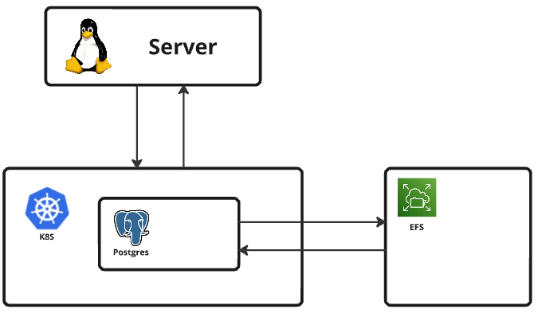

## 목차

1. [개요](#개요)
2. [필요 환경](#필요-환경)
3. [구성 요소](#구성-요소)
4. [설치](#설치)
5. [사용 방법](#사용-방법)
6. [구현](#관련된-파일,-간단한-설명)
7. [데이터 추적](#데이터-추적)


## 개요

Kubernetes 환경에서 PostgreSQL 클러스터를 배포하기 위한 구성을 제공합니다.

내구성, 가용성에 초점을 두었으며, 이를 위해 데이터를 AWS의 여러 가용영역에 저장하고, 다수의 인스턴스에서 접속할 수 있게 할 수 있도록 EFS를 마운트하여 데이터를 저장하였습니다.



EBS를 볼륨으로 사용하고자 하는 경우 시스템 다운을 막기 위해 반드시 수평적 확장 기능을 포함시켜야 합니다. (현재 용량 제한이 없는 EFS를 사용중)

## 필요 환경

- Kubernetes 클러스터
- EFS 파일 시스템 (파일 생성 권한이 있어야 함)
- 클러스터에 설치된 EFS CSI 드라이버


## 구성 요소

- 주 PostgreSQL 인스턴스를 위한 ConfigMap, StatefulSet, Service
- 영구 데이터 저장을 위한 EFS
- EFS를 사용하기위한 PersistentVolume, PersistentVolumeClaim


## 설치

1. 저장소를 클론합니다. 파일은 instance1/k8s/app/db/postgresql에 위치합니다.
    ```
    git clone https://github.com/WestDragonWon/yeardream-miniproject.git
    ```

2. PV에 본인의 EFS ID를 작성합니다. (volumeHandle부분)
    ```
    vim instance1/k8s/resources/pv/postgres-pv.yaml
    ```

3. 구성을 적용합니다.
    ```
    kubectl apply -f <clone한 경로>/instance1/k8s/resources/storageclass/postgresql-storageclass.yml
    kubectl apply -f <clone한 경로>/instance1/k8s/resources/configmap/postgres-cm.yml
    kubectl apply -f <clone한 경로>/instance1/k8s/resources/pv/postgres-pv.yaml
    kubectl apply -f <clone한 경로>/instance1/k8s/app/db/postgresql/postgresql.yaml
    ```


## 사용 방법

PostgreSQL Pod 연결 :
  
    `kubectl exec -it postgres-0 -- /bin/bash -c "psql -U postgres"`
  

postgres 유저로 Postgres 실행 (Pod 내에서): 
    `psql -U postgres`  
데이터베이스 리스트 : `\list`  
데이터베이스 접속 : `-c 데이터베이스 이름`

## 관련된 파일, 간단한 설명

**deployment, service**
파일 명 : postgresql.yaml
위치 : instance1/k8s/app/db/postgresql/
목적 : Postgres용 StatefulSet, Service를 만든다

**storageclass**
파일 명 : postgresql-storageclass.yml
위치 : instance1/k8s/resources/storageclass/
목적 : pv로 EFS를 사용할 수 있도록 한다.

**persistentvolume, persistentvolumeclaim**
파일 명 : postgres_pv.yaml
위치 : instance1/k8s/resources/pv/
목적 : postgres의 데이터 저장소를 EFS와 연동하여 사용하기위한 볼륨을 만든다

**configmap**
파일 명 : postgresql-cm.yml
위치 : instance1/k8s/resources/configmap/
목적 : 모든 IP에서 PG에 접근할 수 있도록 설정파일에서 접근권한을 수정한다.

코드에 대한 설명은 주석으로 작성해놓았습니다.

## 데이터 추적
### history table 생성
데이터 변경을 추적하기 위해 history_table을 만들고, 생성/수정/삭제 내역을 시간과 함께 기록할 수 있습니다.

1. 초기 상태 : test_table에 id : 1, name : Test Data인 데이터가 저장되어있습니다.  
  

2. 데이터 삽입 시 history_table에 삽입 내용, 이벤트 발생 시간이 기록됩니다.  
  

3. 데이터 수정 시에도 마찬가지로 history_table에 수정 전/후 내용, 이벤트 발생 시간이 기록됩니다.  
  
  
  

4. 데이터 삭제 시에도 기록됩니다.
  
<details>  
<summary>구현 방법 :  </summary>  

1. 우선 history_table을 생성해줍니다.  
    ---history_table 생성 명령어 :
    ```
    CREATE TABLE history_table(  
    id SERIAL PRIMARY KEY,  
    table_name TEXT,  
    operation_type TEXT,  
    changed_data JSONB,  
    changed_at TIMESTAMP DEFAULT CURRENT_TIMESTAMP  
    );  
    ```

예시로 든 스크린샷에는 user_id 컬럼이 존재하는걸 확인할 수 있는데, 이런 식으로 원본 데이터를 참조하게 구성한다면 원본 데이터의 컬럼 이름이 바뀐다거나 컬럼이 삭제되는 등의 이벤트에 추가적인 작업이 필요하다고 판단되어 제거 후 생성하였습니다.

2.  원본 테이블에 INSERT, UPDATE, DELETE 되기 전 history_table에 변경 내용과 시간을 기록하는 기능을 제공하는 함수를 만듭니다.
    ```
    CREATE OR REPLACE FUNCTION log_user_changes()
    RETURNS TRIGGER AS $$
    BEGIN
        -- 예외가 발생할 수 있는 부분을 try-except처럼 처리
        BEGIN
            IF (TG_OP = 'INSERT') THEN
                INSERT INTO history_table (table_name, operation_type, changed_data)
                VALUES (TG_TABLE_NAME, 'INSERT', row_to_json(NEW));
                RETURN NEW; -- TG_TABLE_NAME으로 데이터가 삽입되는 테이블의 이름을 알 수 있다. NEW : INSERT, UPDATE에 의해 추가되는 데이터
            ELSIF (TG_OP = 'UPDATE') THEN
                INSERT INTO history_table (table_name, operation_type, changed_data)
                VALUES (TG_TABLE_NAME, 'UPDATE', jsonb_build_object('before', row_to_json(OLD), 'after', row_to_json(NEW)));
                RETURN NEW;
            ELSIF (TG_OP = 'DELETE') THEN
                INSERT INTO history_table (table_name, operation_type, changed_data)
                VALUES (TG_TABLE_NAME, 'DELETE', row_to_json(OLD));
                RETURN OLD; -- OLD : DELETE에 의해 삭제될 데이터
            END IF;
        -- EXCEPTION을 사용해 함수 실행중 오류 발생, 메모리 부족 등으로 작동이 실패해도 원본 데이터에 대한 처리는 되도록 작성
        EXCEPTION WHEN OTHERS THEN
            -- 로그에 오류 메시지 기록 (옵션)
            RAISE NOTICE 'Trigger failed: %', SQLERRM;
            -- 트리거 실패는 무시하고 본 트랜잭션은 계속 진행
            IF (TG_OP = 'INSERT' OR TG_OP = 'UPDATE') THEN
                RETURN NEW;
            ELSIF (TG_OP = 'DELETE') THEN
                RETURN OLD;
            END IF;
        END;
    END;
    $$ LANGUAGE plpgsql;
    ```

예외 처리를 통해 함수 실행에 실패하더라도 원본 데이터를 삽입/수정/삭제할 수 있도록 하였습니다.  
어떠한 경우에도 원본 데이터 수집에 문제가 생기는 걸 방지하기 위함입니다.  
만약 일부 누실되어도 괜찮은 데이터이고, 변경 내역을 추적하는 게 더 중요하다면 Line 3의 BEGIN과 LINE 19부터의 EXCEPTION 부분을 제거하여 history_table에 기록된 데이터만 처리할 수 있습니다.

3. test_table에 데이터 삽입, 수정, 삭제 시 위 함수를 실행할 수 있도록 trigger를 작성합니다.
    ```
    CREATE TRIGGER user_changes_trigger
    AFTER INSERT OR UPDATE OR DELETE ON test_table
    FOR EACH ROW
    EXECUTE FUNCTION log_user_changes();
    ```

이렇게 생성된 트리거는 눈에 잘 보이지 않아 확인이 어렵다는 단점이 있습니다.
예를 들어, 트리거의 존재를 모른 채 history_table이나 원본 테이블에 수정을 가하면 전체 데이터라인이 먹통이 될 수 있습니다.
이에 대한 권한이 있는 사람만 DB를 수정할 수 있도록 권한을 생성하였습니다.
</details>


### manager role 생성
배경 지식이 부족한 사원이 테이블 구조를 수정하는 걸 방지하기 위해 manager role을 생성하고, 이 역할이 있는 사용자만 테이블을 수정할 수 있도록 하였습니다.  
1. Role을 만들고, 데이터베이스 커넥션 권한을 부여합니다.  
권한이 필요한 사용자와 Role을 바인딩 하고, 테이블의 Owner를 Role로 바꿔줍니다.  
  

테이블 권한이 바뀌었습니다.  
2. 권한을 받은 사용자로 접속해 테이블 스키마를 수정해봅니다.  
  
성공적으로 바뀌었습니다.  
3. 권한이 존재하지 않는 사용자로 접속해 테이블 스키마를 수정해봅니다.  
  
에러가 발생하며 스키마가 수정되지 않습니다.  