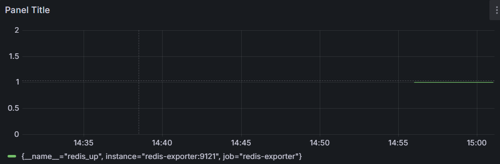
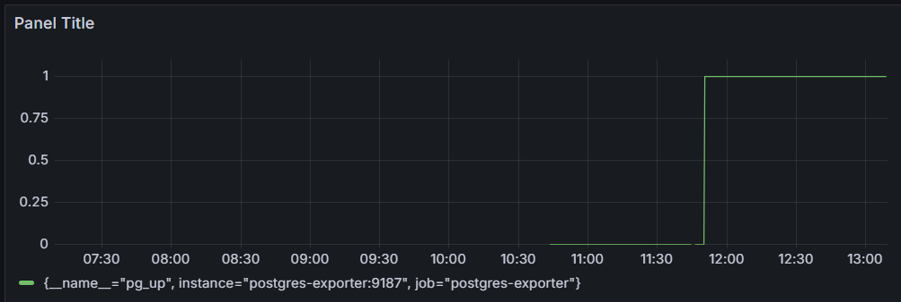

# Prometheus configmap으로 알람 규칙 설정 -> alertmanager로 알람 보내기가능

kafka_up

pg_up

redis_up

es

exporter 에러핸들링

exporter 부분에서 가장 많은 실패를 겪음. 각 회사별로 인자 설정이 다르다 보니 같은 설정이라고 생각했던 것들을 반복만 하면 되겠구나 하는 얕은 생각으로 덤볐다가 

큰코 다치게 되었음. 게다가 이미지를 만든 사람의 가이드를 따라서 해도 안되는 경우도 있다(?) 그래도 우여곡절 끝에 redis, mongo, postgres, es들의 exporter 연결을

성공했지만 ls에서 벽에 막힘. 얘는 이미지도 죄다 서비스 종료된 것들 뿐이고 그나마 요새 활발한 이미지는 인자값이 없다??? 그리고 자꾸 .env 파일을 요구하여서 설정 해주고

configmap도 설정해줬지만 해결되지 않았음. 결론은 logstash는 다들 철수를 한 거 같으니 exporter를 연결할 필요가 없어보임.