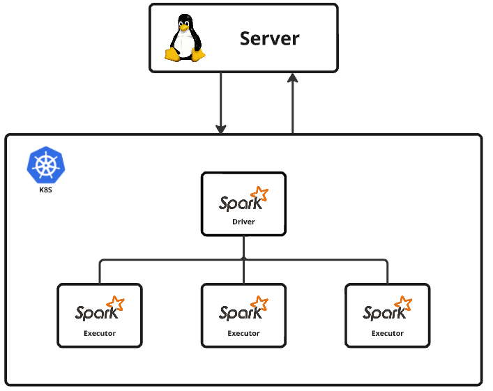

## 목차

1. [개요](#개요)
2. [필요 환경](#필요-환경)
3. [구성 요소](#구성-요소)
4. [실행 방법](#실행-방법)
5. [트러블 슈팅](#트러블-슈팅)
6. [시행 착오](#시행-착오)


## 개요

로컬 서버에 Spark submit 할 수 있는 환경을 만들고, 쿠버네티스 API 서버에 Job을 제출하여 driver, executor 파드를 동적으로 만드는 방법을 사용하였습니다.




## 필요 환경

- Kubernetes 클러스터
- Spark 엔진 (K8s에 Job 제출 용도) - 버전 : 3.5.1
- Docker 이미지를 빌드하고, Docker Hub에 배포할 수 있는 환경
- Java 17


## 구성 요소

- Spark Job Submit을 위한 파일들 (sparkhome 디렉토리)
- 실행을 원하는 파일들을 묶어 이미지로 만들기 위한 Dockerfile (sparkhome/docker 디렉토리)
- driver, executor 생성시 볼륨, 환경 변수를 사용할 수 있게 해주는 pod-template
- 구현하려고 했으나 실패하여 흔적으로 남은 파일들 (backup 디렉토리)


## 실행 방법

1. 저장소를 클론합니다. 파일은 instance1/k8s/app/processing/spark에 위치합니다.:
    ```
    git clone https://github.com/WestDragonWon/yeardream-miniproject.git
    cd instance1/k8s/app/processing/spark
    ```

2. 디렉토리를 SPARK_HOME 환경변수로 등록해줍니다.
    ```
    vim ~/.bashrc
    마지막 줄에
    export SPARK_HOME="<커밋한 디렉토리>/instance1/k8s/app/processing/spark"
    export PATH=$PATH:$SPARK_HOME/bin:$SPARK_HOME/sbin
    ```

3. 실행시키고 싶은 파일들과, 실행하기 위해 필요한 파일 등을 sparkhome 디렉토리 속 원하는 위치에 넣습니다. (실행 파일은 jobs 디렉토리에, jar 파일의 경우 sparkhome디렉토리에 jars 디렉토리를 만들어 넣으면 됩니다.)

4. 도커 파일을 커스텀합니다. sparkhome/dockerfile/Dockerfile에 위치하고있으며, 기본적으로 spark:3.5.2, Java17을 사용할 수 있는 환경에 jars 디렉토리와 jobs 디렉토리를 컨테이너 안에 복사하도록 구성되어있습니다.
    ```
    FROM spark:3.5.2-scala2.12-java17-ubuntu
    
    USER root
    
    RUN set -ex; \
        apt-get update; \
        apt-get install -y python3 python3-pip; \
        rm -rf /var/lib/apt/lists/*
    
    COPY jars /opt/spark/jars
    COPY jobs /opt/spark/jobs
    
    USER spark
    ```

5. 이미지로 만들어 빌드, 배포합니다.
    ```
    docker build -t <DockerHub ID>/<이미지 이름>:<태그> \ 
    -f $SPARK_HOME/docker/Dockerfile \ 
    $SPARK_HOME
    ```

    `docker push <DockerHub ID>/<이미지 이름>:<태그>`

6. K8s API서버에 잡을 제출합니다.
    ```
    $SPARK_HOME/bin/spark-submit \ 
      --master k8s://https://master:6443 \ 
      --deploy-mode cluster \ 
      --name <파드 이름> \ 
      --conf spark.kubernetes.authenticate.driver.serviceAccountName=spark \ 
      --conf spark.executor.instances=2 \ 
      --conf spark.executor.cores=1 \ 
      --conf spark.executor.memory=2g \ 
      --conf spark.kubernetes.container.image=westdragonwon/<이미지 이름>:<태그> \ 
      --conf spark.kubernetes.namespace=spark \ 
      local:///opt/spark/jobs/<파일 이름>
    ```


Pod template을 이용하여 Job에서 필요한 환경변수, 마운트 해야하는 볼륨, 필요한 자원 을 커스텀할 수 있습니다. ($SPARK_HOME/podtemplate 위치에 예시 pod template을 넣어놓았습니다.)

예시로, workflow 시크릿에 저장된 AWS ACCESS KEY와 AWS SECRET KEY를 환경 변수로 받을 수 있도록 하였고, 리소스를 명시적으로 지정하였으며, 로그를 기록하기 위해 EFS pv를 연결해놓았습니다.
  
pod template 사용법 : 
```
  --conf spark.kubernetes.driver.podTemplateFile=$SPARK_HOME/podtemplate/driver-pod-template.yaml \
  --conf spark.kubernetes.executor.podTemplateFile=$SPARK_HOME/podtemplate/executor-pod-template.yaml \
```
  
예를 들어, 
```
$SPARK_HOME/bin/spark-submit \
  --master k8s://https://master:6443/ \
  --deploy-mode cluster \
  --name <테스트 이름> \
  --conf spark.executor.instances=2 \
  --conf spark.executor.cores=1 \
  --conf spark.executor.memory=2g \
  --conf spark.kubernetes.container.image=<계정명>/<이미지 이름>:<태그> \
  --conf spark.kubernetes.authenticate.driver.serviceAccountName=spark \
  --conf spark.kubernetes.executor.deleteOnTermination=true \
  --conf "spark.eventLog.enabled=true" \
  --conf "spark.eventLog.dir=file:/mnt/spark-history-logs" \
  --conf "spark.kubernetes.driver.volumes.persistentVolumeClaim.sparkhistoryserver-pvc.options.claimName=sparkhistoryserver-pvc" \
  --conf "spark.kubernetes.driver.volumes.persistentVolumeClaim.sparkhistoryserver-pvc.mount.path=/mnt/spark-history-logs" \
  --conf "spark.kubernetes.executor.volumes.persistentVolumeClaim.sparkhistoryserver-pvc.options.claimName=sparkhistoryserver-pvc" \
  --conf "spark.kubernetes.executor.volumes.persistentVolumeClaim.sparkhistoryserver-pvc.mount.path=/mnt/spark-history-logs" \
  --conf spark.driverEnv.AWS_ACCESS_KEY_ID=$(kubectl get secret workflow -o jsonpath="{.data.AWS_ACCESS_KEY_ID}" | base64 --decode) \
  --conf spark.driverEnv.AWS_SECRET_ACCESS_KEY=$(kubectl get secret workflow -o jsonpath="{.data.AWS_SECRET_ACCESS_KEY}" | base64 --decode) \
  --conf spark.executorEnv.AWS_ACCESS_KEY_ID=$(kubectl get secret workflow -o jsonpath="{.data.AWS_ACCESS_KEY_ID}" | base64 --decode) \
  --conf spark.executorEnv.AWS_SECRET_ACCESS_KEY=$(kubectl get secret workflow -o jsonpath="{.data.AWS_SECRET_ACCESS_KEY}" | base64 --decode) \
  local:///opt/spark/jobs/<파일 이름>
```
의 복잡한 명령어를

```
$SPARK_HOME/bin/spark-submit \
  --master k8s://https://master:6443/ \
  --deploy-mode cluster \
  --name <테스트 이름> \
  --conf spark.executor.instances=2 \
  --conf spark.kubernetes.container.image=<계정명>/<이미지 이름><태그> \
  --conf spark.kubernetes.authenticate.driver.serviceAccountName=spark \
  --conf spark.kubernetes.executor.deleteOnTermination=true \
  --conf "spark.eventLog.enabled=true" \
  --conf "spark.eventLog.dir=file:/mnt/spark-history-logs" \
  --conf spark.kubernetes.driver.podTemplateFile=$SPARK_HOME/podtemplate/driver-pod-template.yaml \
  --conf spark.kubernetes.executor.podTemplateFile=$SPARK_HOME/podtemplate/executor-pod-template.yaml \
  local:///opt/spark/jobs/<파일 이름>
```
로 줄일 수 있습니다.  


## 트러블 슈팅
현상 : 잡 제출시 포트가 int 형식 7077이 아닌 string 형식"spark://spark-master:7077"로 입력되는 현상 발생  
원인 : spark 에서는 SPARK_MASTER_PORT 환경변수를 7077로 지정하는 방식으로 포트를 찾는다. service name을 spark-master로 작성시 이 환경변수가 덮어씌워지므로 반드시 서비스의 이름을 spark-master와 다르게 만들어야 한다.

현상 : 스파크 설치시 서버에 연동된 깃에 푸시가 안되는 현상 발생  
원인 : 깃허브에 올릴 수 있는 파일에는 용량 제한이 있다. 스파크 설치시 많은 파일들이 생기는데, 그 중 용량이 큰 파일때문에 매일 실행되도록 설정한 자동푸시가 되지 않았다.
gitignore에 .jar 을 등록하여 용량이 큰 jar 파일들을 푸시되지 않게 하였다.

현상 : job 제출이 제대로 안 되는 현상 발생  
원인 : spark-submit에서, 역슬래시( \\ ) 사용하여 줄 구분시 역슬래시 뒤에 공백이 포함되면 안 된다.


## 시행착오

구상 초기, Kubernetes 안에 Stand Alone 형식으로 Spark Cluster 환경을 구성하려고 했으나 실패했습니다.

Master 역할을 할 파드를 하나 띄우고, Worker 역할을 할 파드 세개를 띄운 뒤 서로 연결하는 방식으로,
- 스파크를 사용하기 위한 자원이 항상 준비되어있다
- 잡이 종료되어도 로그를 확인할 수 있다
- Job이나 jar 등 실행시 필요한 파일들을 도커 이미지에 포함시켜 빌드, 푸시하지 않고 간편하게 copy할 수 있다
등의 장점이 있습니다.

Master 파드와 Worker 파드를 연결하는 데 성공했으나, 잡 제출시 Worker 파드에 Executor가 생성되지 않았습니다.

많은 노력을 했으나 결국 구현하지 못한 것이 아쉬워  작성했던 코드들에 대한 기록을 남깁니다.


파일 명 : master.yaml
목적 : Spark 클러스터의 master 역할을 할 Deployment, Service를 만든다.
내용 :
```
apiVersion: apps/v1
kind: Deployment
metadata:
  name: spark-master-deployment
  labels:
    app: spark
spec:
  replicas: 1
  selector:
    matchLabels:
      app: spark
      role: master
  template:
    metadata:
      labels:
        app: spark
        role: master
    spec:
      containers:
      - name: spark-master-container
        image: apache/spark:3.5.1
        ports:
        - containerPort: 7077    #master, worker가 통신할 포트
        - containerPort: 4040    #제출된 Job을 웹으로 확인하기 위한 포트
        - containerPort: 8080    #클러스터 구성을 확인하기 위한 포트
        env:    #스파크 모드를 지정하고, AWS 및 PG에 접속하기 위한 환경 변수 설정
        - name: SPARK_MODE
          value: "master"
        - name: AWS_ACCESS_KEY_ID    
          valueFrom:
            secretKeyRef:
              name: workflow
              key: AWS_ACCESS_KEY_ID
        - name: AWS_SECRET_ACCESS_KEY
          valueFrom:
            secretKeyRef:
              name: workflow
              key: AWS_SECRET_ACCESS_KEY
        - name: POSTGRES_USERNAME    
          valueFrom:
            secretKeyRef:
              name: workflow
              key: POSTGRES_USER
        - name: POSTGRES_PASSWORD
          valueFrom:
            secretKeyRef:
              name: workflow
              key: POSTGRES_PASSWORD
        - name: SPARK_LOCAL_IP    #파드의 IP를 환경변수로 설정하기 위한 부분
          valueFrom:
            fieldRef:
              fieldPath: status.podIP
            #- name: SPARK_WORKER_INSTANCES
            #value: "3"
        command: ["/opt/spark/bin/spark-class", "org.apache.spark.deploy.master.Master"]
        args: ["--host", "$(SPARK_LOCAL_IP)", "--port", "7077", "--webui-port", "8080"]
        #마스터로 사용하기위한 명령어, 이 명령어가 잘못되어서 executor가 생성이 안 되는 것일 수도 있다.
        volumeMounts:    #jars는 반드시 /opt/spark/jars에 위치해야 스파크가 인식할 수 있다.
        - name: spark-jars-volume
          mountPath: /opt/spark/jars
        - name: spark-jobs-volume
          mountPath: /opt/spark/work-dir
        resources:
          requests:
            cpu: "500m"
            memory: "1Gi"
          limits:
            cpu: "500m"
            memory: "1Gi"
      volumes:
      - name: spark-jars-volume
        persistentVolumeClaim:
          claimName: spark-jars-pvc
      - name: spark-jobs-volume
        persistentVolumeClaim:
          claimName: spark-jobs-pvc

      #nodeSelector:
        #type: master
---
apiVersion: v1
kind: Service
metadata:
  name: spark-master-service   ##!!!!반드시!!! spark-master라고 하면 안됨. spark가 사용하는 환경변수 이름이 SPARK_MASTER_PORT인데, 서비스 이름을 spark-master라고 지정하면 쿠버네티스도 같은 이름으로 다른 내용의 변수를 생성
  labels:
    app: spark
spec:
  type: NodePort
  ports:
  - name: spark-master-port    #마스터와 워커끼리 통신할 포트
    port: 7077
    targetPort: 7077
    nodePort: 32077
  - name: spark-master-ui      #클러스터 구성을 확인하기 위한 포트
    port: 8080
    targetPort: 8080
    nodePort: 32080
  - name: spark-master-ui2     #제출된 잡 상태를 확인하기 위한 포트
    port: 4040
    targetPort: 4040
    nodePort: 32040
  selector:
    app: spark
    role: master
```

파일 명 : worker.yaml
목적 : Spark 클러스터의 worker 역할을 할 Deployment, Service를 만든다.
내용 :
```
apiVersion: apps/v1
kind: Deployment
metadata:
  name: spark-worker-deployment
  labels:
    app: spark
spec:
  replicas: 3
  selector:
    matchLabels:
      app: spark
      role: worker
  template:
    metadata:
      labels:
        app: spark
        role: worker
    spec:
      serviceAccountName: spark  # ServiceAccount를 지정
      containers:
      - name: spark-worker-container
        image: apache/spark:3.5.1
        ports:                  #워커 상태를 확인하기 위한 포트
        - containerPort: 8081
        env:  #스파크 모드를 지정하고, AWS 및 PG에 접속하기 위한 환경 변수 설정
        - name: SPARK_MODE
          value: "worker"
        - name: AWS_ACCESS_KEY_ID
          valueFrom:
            secretKeyRef:
              name: workflow
              key: AWS_ACCESS_KEY_ID
        - name: AWS_SECRET_ACCESS_KEY
          valueFrom:
            secretKeyRef:
              name: workflow
              key: AWS_SECRET_ACCESS_KEY
        - name: POSTGRES_USERNAME
          valueFrom:
            secretKeyRef:
              name: workflow
              key: POSTGRES_USER
        - name: POSTGRES_PASSWORD
          valueFrom:
            secretKeyRef:
              name: workflow
              key: POSTGRES_PASSWORD
        - name: SPARK_LOCAL_IP  #파드의 IP를 환경변수로 지정
          valueFrom:
            fieldRef:
              fieldPath: status.podIP
        command: ["/opt/spark/bin/spark-class", "org.apache.spark.deploy.worker.Worker"]
        args: ["spark://spark-master-service:7077", "--host", "$(SPARK_LOCAL_IP)", "--webui-port", "8081"]
        #워커로 설정하기 위한 명령어, 이 명령어가 잘못되어서 executor가 생성이 안 되는 것일 수도 있다.
        volumeMounts:  #jars는 반드시 /opt/spark/jars에 위치해야 스파크가 인식할 수 있다.
          #- name: spark-jars-volume
          #mountPath: /opt/spark/jars
        - name: spark-jobs-volume
          mountPath: /opt/spark/work-dir
        resources:    #메모리 리소스가 부족하여 executor가 생성이 안 될 가능성도 있어서 넉넉하게 설정해보았다.
          requests:
            cpu: "1"
            memory: "3Gi"
          limits:
            cpu: "1"
            memory: "3Gi"
      volumes:
        #- name: spark-jars-volume
        #persistentVolumeClaim:
        #  claimName: spark-jars-pvc
      - name: spark-jobs-volume
        persistentVolumeClaim:
          claimName: spark-jobs-pvc
      nodeSelector:
        type: worker

---
apiVersion: v1
kind: Service
metadata:
  name: spark-worker-service
  labels:
    app: spark
spec:
  type: NodePort
  ports:
  - name: spark-worker-ui
    port: 8081
    targetPort: 8081
    nodePort: 32081
  selector:
    app: spark
    role: worker
```

파일 명 : spark-pv.yaml
목적 : jar, job이 저장된 EFS를 Pod에 마운트하여 원하는 파일들을 쉽게 파드에 전달한다.
내용 :
```
apiVersion: v1
kind: PersistentVolume
metadata:
  name: spark-jars-pv
spec:
  capacity:
    storage: 3Gi  # 스토리지 크기 (EFS는 실제 크기 제한 없음)
  volumeMode: Filesystem
  accessModes:
    - ReadWriteMany  # Master, Worker 등 다수의 Pod에서 접근 가능
  persistentVolumeReclaimPolicy: Retain  # PVC가 삭제되어도 PV 유지 (EFS와 연동하였으므로 Delete여도 될 것으로 예상)
  storageClassName: spark-storageclass  # 수정된 StorageClass 이름
  csi:
    driver: efs.csi.aws.com
    volumeHandle: fs-00fb81d888c7ed27c::fsap-0d9a6814ce62a4ba1  # <jar 파일이 저장된 EFS ID>::<경로>
---
apiVersion: v1
kind: PersistentVolume
metadata:
  name: spark-jobs-pv
spec:
  capacity:
    storage: 1Gi  # 스토리지 크기 (EFS는 실제 크기 제한 없음)
  volumeMode: Filesystem
  accessModes:
    - ReadWriteMany  # Master, Worker 등 다수의 Pod에서 접근 가능
  persistentVolumeReclaimPolicy: Retain  # PVC가 삭제되어도 PV 유지 (EFS와 연동하였으므로 Delete여도 될 것으로 예상)
  storageClassName: spark-storageclass  # 수정된 StorageClass 이름
  csi:
    driver: efs.csi.aws.com
    volumeHandle: fs-00fb81d888c7ed27c::fsap-0a5131b6e82bd3039  # <job 파일이 저장된 EFS ID>::<경로>
---
apiVersion: v1
kind: PersistentVolumeClaim
metadata:
  name: spark-jars-pvc
spec:
  accessModes:
    - ReadWriteMany
  storageClassName: spark-storageclass
  resources:
    requests:
      storage: 3Gi
---
apiVersion: v1
kind: PersistentVolumeClaim
metadata:
  name: spark-jobs-pvc
spec:
  accessModes:
    - ReadWriteMany
  storageClassName: spark-storageclass
  resources:
    requests:
      storage: 1Gi
```

![[Pasted image 20241008001800.png]]

추가로, job submit시 