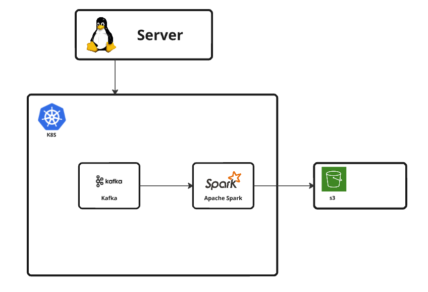

# 스파크 잡

## 개요

스파크 잡을 쿠버네티스에서 관리되도록 제출할 수 있습니다. (잡을 제출하는 자세한 방법은 [이전 디렉토리 README.md](../README.md)의 실행 방법에 작성해놓았습니다.)

[다양한 수집부](../../../../app/datacollection/python/README.md)에 의해 Kafka 에 들어오는 데이터를 S3에 저장하는 Streaming job을 만들었습니다. (kafka consumer)


### 1. 카프카 메시지 스키마 정의
메시지에 대한 처리를 하려면 데이터 스키마가 정의되어있어야 합니다.  
각 속성의 이름과, 타입을 명시해줍니다.

### 2. 스파크 세션 생성
스파크를 사용하여 Job을 돌리기위한 세션을 생성합니다.    
driver의 이름이 될 appname과, 필요한 종속성을 명시해줍니다.

### 3. 카프카의 데이터를 구독
다양한 원천 데이터는 전부 카프카를 통해 S3에 저장되도록 하였습니다.  
Spark의 readstream을 사용하여 카프카 특정 토픽을 구독합니다.
  
### 4. 처리 (Transform)
데이터가 저장되기 전에 이상 거래를 탐지하거나, 암호화를 하는 등의 작업을 할 수 있습니다. 이상치를 원천 데이터 저장소에 저장하고 싶지 않은 경우, 이 과정에서 제외할 수 있습니다.

### 5. 저장  
writeStream 형식으로 S3에 데이터를 저장합니다.  
분석을 편하게 하기 위해 연/월/일/시 디렉토리 구조로 데이터를 저장하도록 하였습니다.


## 잡 제출
로컬의 spark-submit 파일로 잡을 제출합니다.  
master를 k8s로 지정하여 쿠버네티스 파드로 driver, executor를 관리할 수 있습니다.  
deploy-mode로는 cluster, client 모드가 있으며, cluster mode의 경우 드라이버가 클러스터 내(마스터 혹은 워커)에서 실행되어 네트워크 독립적이라는 특징이 있고, client mode의 경우 드라이버가 클라이언트 머신에서 실행되어 클러스터와 클라이언트 간 네트워크가 필요하다는 특징이 있습니다.  
executor의 리소스를 정할 수 있습니다. 명령어로 매번 작성하기 번거로운 경우 pod template(후술)에 작성하여 일관성을 유지할 수 있습니다.  
executor의 개수를 정해줘야 합니다.  
driver, executor에서 사용할 이미지를 지정해줍니다. 잡을 처리하기 위해 각 executor마다 spark 파일(.py 등)과 그에 해당하는 종속성 파일 (.jar 등), data 파일(.csv 등)이 필요합니다. 따라서, spark 이미지에 job, jar, data 등을 추가하여 도커 이미지로 만들고, 레지스트리에 푸시하는 작업이 선행되어야 합니다.  
이미지 내에 잡이 저장된 디렉토리에서 파일을 실행하도록 명령합니다.  
  
예)
```
$SPARK_HOME/bin/spark-submit \ 
    --master k8s://https://master:6443 \ 
    --deploy-mode cluster \ 
    --name <파드 이름> \ 
    --conf spark.kubernetes.authenticate.driver.serviceAccountName=spark \ 
    --conf spark.executor.instances=2 \ 
    --conf spark.executor.cores=1 \ 
    --conf spark.executor.memory=2g \ 
    --conf spark.kubernetes.container.image=westdragonwon/<이미지 이름>:<태그> \ 
    --conf spark.kubernetes.namespace=spark \ 
    local:///opt/spark/jobs/<파일 이름>
```

## Pod Template
Pod template을 이용하여 Job에서 필요한 환경변수, 마운트 해야하는 볼륨, 필요한 자원 을 관리할 수 있습니다.
```
apiVersion: v1
kind: Pod
metadata:
labels:
    version: "3.5.1"
spec:
nodeSelector:
    type: worker
containers:
    - name: spark-kubernetes-driver
    env:
        - name: AWS_ACCESS_KEY_ID
        valueFrom:
            secretKeyRef:
            name: workflow
            key: AWS_ACCESS_KEY_ID
        - name: AWS_SECRET_ACCESS_KEY
        valueFrom:
            secretKeyRef:
            name: workflow
            key: AWS_SECRET_ACCESS_KEY
    resources:
        requests:
        memory: "500Mi"
        cpu: "300m"
        limits:
        memory: "1Gi"
        cpu: "1"
    volumeMounts:
        - name: history-volume
        mountPath: /mnt/spark-history-logs
volumes:
    - name: history-volume
    persistentVolumeClaim:
        claimName: sparkhistoryserver-pvc
```
yaml 형식으로 필요한 볼륨, 리소스, 환경변수 를 지정한 뒤  

```
--conf spark.kubernetes.driver.podTemplateFile=$SPARK_HOME/podtemplate/driver-pod-template.yaml \
--conf spark.kubernetes.executor.podTemplateFile=$SPARK_HOME/podtemplate/executor-pod-template.yaml \
```
양식으로 명령어에 추가하여 파드 템플릿을 사용할 수 있습니다.

## 테스트
### 스파크 잡 중지 후 데이터 삽입
스파크 잡이 중지된 동안 kafka에 들어온 데이터가 잡 재개시 S3에 저장될 수 있는지 확인해보았습니다.  
.png>)  
파드 삭제로 잡 강제 종료  
.png>)  
잡이 종료된 동안 데이터 삽입
.png>)  
잡 재개시 그동안의 데이터를 한 번에 읽어옴을 확인하였습니다. (위 사진에서, 오후 1시 52분에 들어온 데이터)  
잡을 구현할 때 S3 버킷에 체크포인트를 설정하여 잡이 중지되어도 데이터의 오프셋이 기록되고, 재개시 저장된 오프셋에서부터 데이터를 읽어오는 방식으로 작동합니다.

