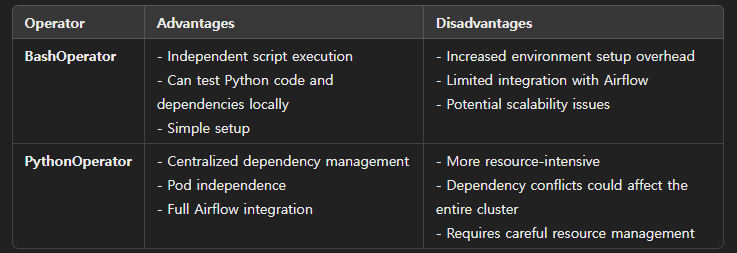

## 목차
1. [BashOperator vs PythonOperator](#bashoperator-vs-pythonoperator)
2. [BashOperator](#bashoperator)
3. [PythonOperator](#pythonoperator)
4. [kafkaCsvProducerAll.py](#kafkacsvproducerallpy)
5. [kafkaCsvProducerBychunk.py](#kafkaCsvProducerBychunkpy)
6. [kafkaJsonProducer.py](#kafkaJsonProducerpy)
7. [kafkaJsonProducer.py](#kafkaJsonProducerpy)
8. [kafkaJsonProducer.py](#kafkaJsonProducerpy)
9. [kafkaJsonProducer.py](#kafkaJsonProducerpy)
10. [kafkaJsonProducer.py](#kafkaJsonProducerpy)

## BashOperator vs PythonOperator

## BashOperator
- 장점
1. 테스트를 로컬환경에서 바로 해 볼 수 있음
2. 테스트를 위한 환경설정이 간편함
- 단점
1. 경로설정이 복잡함
2. 불필요할 수 있는 환경설정을 전부 해주어야 함
3. 에어플로우를 이용한 통합성을 떨어뜨림
4. 파드간 독립성을 떨어뜨림
## PythonOperator
- 장점
1. 환경설정 통합
2. 파드간 독립성 확보
3. 에어플로우를 이용한 통합이 용이
- 단점
1. 테스트 환경설정을 위해 이미지를 변경하고 파드를 내렸다 올려야함
2. 에어플로우와 파이썬 파일간의 의존성 충돌

### kafkaCsvProducerAll.py
- csv 파일을 한번에 kafka로 produce
- 23mb 정도 사이즈의 csv 파일을 gzip으로 압축한 뒤 한번에 kafka message로 보내려고 시도
- kafka conf 설정의 message.max.bytes가 4mb인데 gzip으로 압축한 데이터보다 작아 에러 발생
### kafkaCsvProducerBychunk.py
- csv 파일을 청크단위로 kafka로 produce
- kafka의 message 기본사이즈가 1mb, 데이터를 잘라서 넣어주면 빠를 것이다
- 데이터를 많이 자르면 operator가 많이 생성되고, pandas도 많이 실행되므로 더 느려짐
- kafka message 크기 1MB or 10MB (test필요)
### kafkaJsonProducer.py
- json 파일을 kafka로 produce
- kafka message 사이즈 이상의 json은 message 이하 사이즈(chunk크기로 조절)로 잘라서 보내도록 설정
- 전체 json파일을 여러번 읽도록 되어있어 큰 용량의 json은 적합하지 않음
### fakeData.py
- json 파일을 kafka로 produce
- 기존데이터에서 벗어나는 임의의 값을 가진 versicolor, virginica 데이터를 추가적으로 데이터베이스에 넣어 모델의 정확도를 떨어뜨리고, 임의의 값이 기존 데이터를 무시할 정도로 커졌을 때(정확도 회복) 지금의 임의의 값을 versicolor, virginica로 추론하는지 확인하기 
### s3topg.py
- s3의 parquet 데이터를 pyarrow로 변환하여 SQLAlchemy 엔진으로 postgresql에 저장
- 1시간 스케쥴로 이전시간 s3경로에서 데이터를 가져오도록 설정
### storeAndTrainRegister.py
- (임시경로)에 version관련 파일을 쓰고 읽어서 버전기록
- s3topg.py를 통해 s3데이터를 

