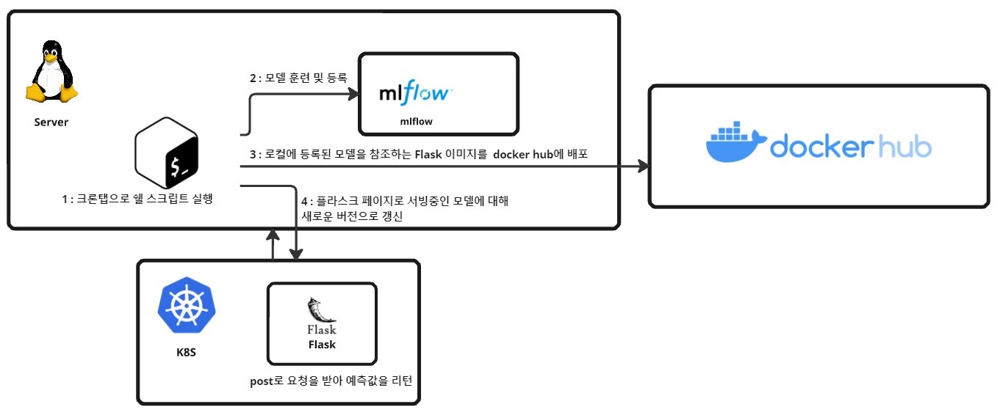
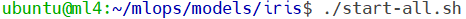
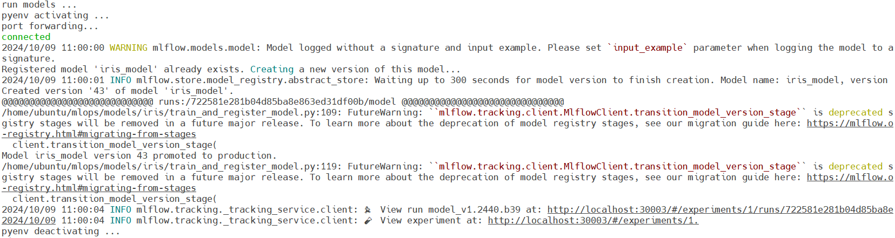
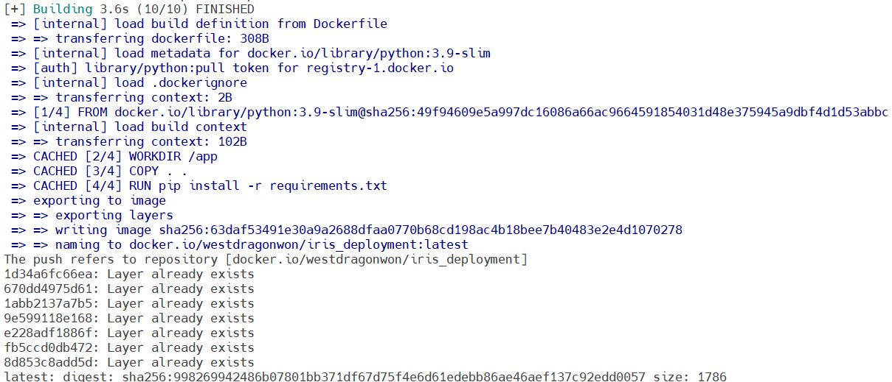
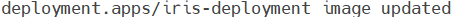

## 목차

1. [개요](#개요)
2. [필요 환경](#필요-환경)
3. [구성 요소](#구성-요소)
4. [설치](#설치)
6. [설명](#관련된-파일,-간단한-설명)
7. [버전 컨트롤](#버전-컨트롤)
8. [실행 이미지](#실행-이미지)


## 개요

하루동안 갱신된 데이터를 사용하여 모델을 훈련하고, 등록한 뒤 플라스크 페이지로 접근 가능한 도커 이미지를 만들어 배포하고, 쿠버네티스로 서빙한다. (주기 : 하루에 한 번, 방법 : crontab)




## 필요 환경

- Kubernetes 클러스터
- 도커 허브에 등록할 수 있는 환경
- mlflow (README 링크 걸어야 함) - 연동되어있으므로 이 문서도 참조하세요


![[Pasted image 20241008205923.png]]


## 구성 요소

- 모델을 훈련하고, mlflow에 등록하는 python 파일
- 버전 컨트롤을 위한 python 파일
- 플라스크 페이지를 도커 이미지로 배포하기 위한 디렉토리
- kubernetes 디플로이로 만들어 모델을 사용할 수 있게 만든 디렉토리
- 자동화를 위한 쉘 스크립트 파일


## 설치

1. 저장소를 클론합니다. 파일은 mlops/models/iris에 위치합니다.
    ```
    git clone https://github.com/WestDragonWon/yeardream-miniproject.git
    ```

2. start-all.sh를 실행합니다.
    `mlops/models/iris/start-all.sh`

## 관련된 파일, 간단한 설명

**모델 훈련 및 등록**
파일 명 : train_and_register_model.py
목적 : mlflow를 사용하여 모델을 훈련하고, 등록한다

**version control**
파일 명 : version_control.py
목적 : 도커 및 mlflow에 등록될 버전을 생성한다.

**배포 이미지 생성**
파일 명 : deploy_model.py
위치 : docker_deploy
목적 : mlflow에 등록된 모델을 참조하는 플라스크 페이지를 만들고, 배포한다.

**deployment, service**
파일 명 : deploy_model.yaml
위치 : k8s_deploy
목적 : 등록된 이미지를 사용하여 쿠버네티스 파드로 만든다

## 버전 컨트롤

모델의 버전을 추적하기위해 HeadVer 버전관리 기법을 사용하였습니다.
다음과 같은 구조를 가집니다.
\<head>.\<yearweek>.\<build>

즉 2024년 32주에 처음 만들어진 버전은
1.2432.b1 의 버전을 가집니다.
build 버전은 파일에 기록되게 하여 하나씩 늘려가는 방식으로 구현했습니다.

## 실행 이미지

1. 쉘 실행  


2. 모델 훈련 및 등록  


3. 도커허브에 이미지 등록


4. 쿠버네티스 버전 갱신

